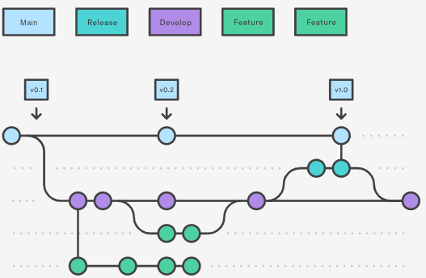

# Git Guideline (Best Practice)

To ensure a smooth and carefree work a git strategy should be defined and used throughout the whole development team.

https://www.atlassian.com/git/tutorials/comparing-workflows/gitflow-workflow

In our case, the develop branch is equal to the main branch for the sake of simplicity.
Maybe in future work it would be extended.

The Master-Branch should always cover a current executable version of the Project.
For new Features please derive your own branch from the master branch and develop it until it is running
(feature branches). Afterward, it might be integrated in the master-branch.
After the projects get to a certain point a new release branch should be
created (release branches). All Release-Branches will cover a collection of executable software-Versions.

| Branch type              | Description                                                                                                                                                                                                                                                   | Branch name |
|--------------------------|---------------------------------------------------------------------------------------------------------------------------------------------------------------------------------------------------------------------------------------------------------------|-------------|
| Development/ main branch | Usually the integration branch for feature work and is the default branch. The branch must be carefully maintained and constantly updated to avoid different versions in use. For pull request workflows, the branch where new feature branches are targeted. | main        |
| Feature branch           | Used for specific feature work or improvements. Generally branches from, and merges back into, the development branch, using pull requests.                                                                                                                   | feature/    |
| Release branch           | Used for release tasks and long-term maintenance versions. They are branched from the development branch and then delivered to the customer.                                                                                                                   | release/    |
| Bugfix branch            | Typically used to fix Release branches.                                                                                                                                                                                                                       | bugfix/     |