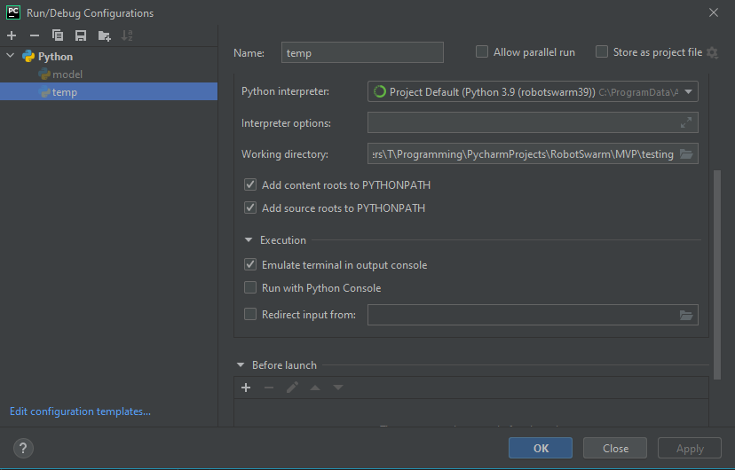
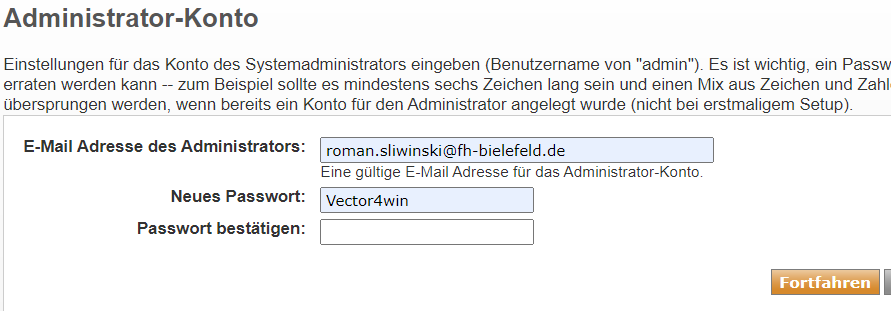
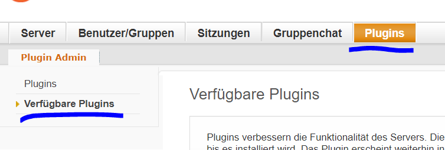
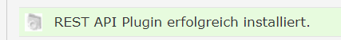
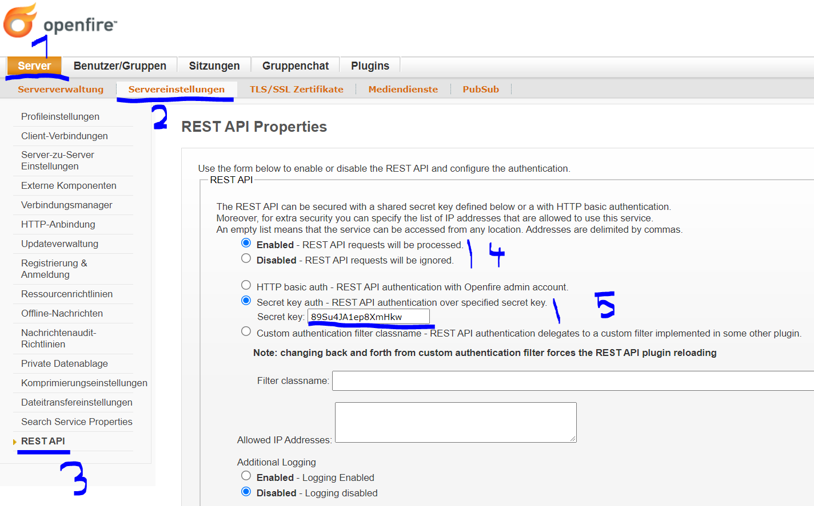

# Setup OFacT Technical Guide

Last edit: March 2025 

### Setup of the Programming Environment

Setting up a python environment for OFacT (install python 3.12 on your machine before) with python version 3.12.
This can help:
https://www.jetbrains.com/help/pycharm/creating-virtual-environment.html



### xmpp Setup

You have two options for the xmpp server (only one is required for execution of the simulation):
1. pyjabber (lightweight and fast python library)
2. Openfire (additional tool)

### Setup of pyjabber (Option 1)

```
pip install pyjabber
```

### Setup of Openfire (Option 2)

Prepare the Multiagent-System by installing the Openfire-XMPP Server to your machine. 
❗Note: Only version 4.7.5 is tested, higher versions have made problems with the rest api. Maybe this is already fixed.
```
https://www.igniterealtime.org/downloads/#openfire
```

After installation the setup will automatically show up in the Browser. 
In the Setup you want to keep most of the recommended options but you need to choose the "integrated Database" 
as for now we won't need the performance of an external service and we want to keep it simple. 
As Email, you may use whatever Mail and password you want - My Choice is shown below.



After setup you need to Login
Username is "admin" and password is the one you chose in the step before.

Now we need to build the administration connection between the Server and our Program.
At first, we need to install the REST-API Plugin to the server - go to the given address and search for the API. 
Click on the install-Button next to it.
Rest API Version 1.10.2

```
http://localhost:9090/available-plugins.jsp
```


If everything worked you will see this message:



Next we need to process some settings in the API to ensure that 
it is configured in the right way and to copy shared secret Key
- we will need this to authorise against the server later:



### Setup of the Program itself (part 1)

Then we need to update the information in the `settings.py` (this should be already done in the template projects):
```python
# constants and settings
XMPP_SERVER_IP_ADDRESS = "YOUR_SERVER_IP" # The URL of where the Openfire-XMPP Server is running - usually Localhost if it runs on th
XMPP_SERVER_SHARED_SECRET = "YOUR_SECRET_KEY" # The shared Secret Key of the Openfire-REST API
XMPP_ALL_AGENTS_PASSWORD = "mvp_password" # in the MVP all agents share the same password
XMPP_SERVER_REST_API_USERS_ENDPOINT = "/plugins/restapi/v1/users" # see https://github.com/seamus-45/openfire-restapi/blob/master/doc
XMPP_SERVER_REST_API_PORT = ":9090" # Port is 9090 by default and 9091 for SSL
```

>💡 Instead of using the REST-API you can also add and manage users in the Openfire-Admin-Panel:
>To create a new user, go to "User/Groups" - "Users" - "Add new User" and enter whatever you need. 
> Mail-Address per User will not be checked so you can leave this empty. 
>Each Agent needs his own account. Add them depending on the System you want to create and store passwords and usernames.

### Setup of the Program itself (part 2)

For alternative 1 pyjabber:
Start the xmpp server by opening the command prompt and typing `pyjabber`

Alternative 2 (openfire):
Now we will do the setup at the program side: first we want to install the API-Library by
```
pip install openfire-restapi
```

Next, you want to install the requirements from the requirements.txt file:

```
pip install -r requirements.txt
```

>💡 That's it!

To get started:
projects/bicycle_world/scenarios/current/main.py

Follow the other readme's ...
