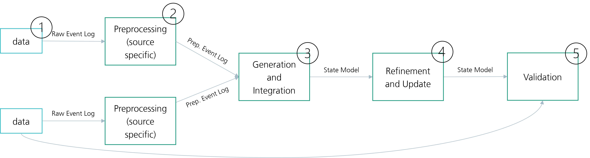

# ToDo: still in development

The model administration is used for both the static state model generation and 
the static state model updating in the data integration process.
Normally, the model generation is used at the beginning of the digital lifecycle and 
data integration after the initial setup. Both use the same code to set up new model objects. 
Even if the data integration is also responsible for integrating new data into the model and 
converts a static state model to a dynamic state model, also the static state model could be updated if required.

To generate the state model, the auto model generation pipeline has to be specified.
This is done in data_source_mapper, currently implemented as Excel file.
Here, the following sheets have to be filled up:

1. general: Used to specify the general elements, such as a reference to the building_blocks specification (explained
   later).
2. data sources: For each data source a row is specified that contains the building blocks and a key that allows the
   mapping to the columns sheet.
3. columns: Specify a row for each data point of the data sources. 
   It specifies the mapping value and also references between the objects. 
   In addition, processing operations can be specified to get a standardized dataset

The building_blocks specification is available as .yml file and stores a key-value pairs, 
where the key is the building block name and the value a reference to the building block.

## Workflow

The workflow is controlled by the `pipeline.py`.

## Top level scheme of the pipeline

1. Data
2. Preprocessing
- data adapter
- standardisation
- process mining if required
- preprocessing
3. Generation and Integration
- State Model Objects Collection
- Generation and Update
4. Refinement and Update
- State Model Refinement
- Control Rule Determination/ Learning
5. Validation
- based on different levels - maybe also a cross-sectional task

# Data Integration

## Workflow

The workflow is controlled by the `pipeline.py`.

# ToDo: make the project specific part project specific 