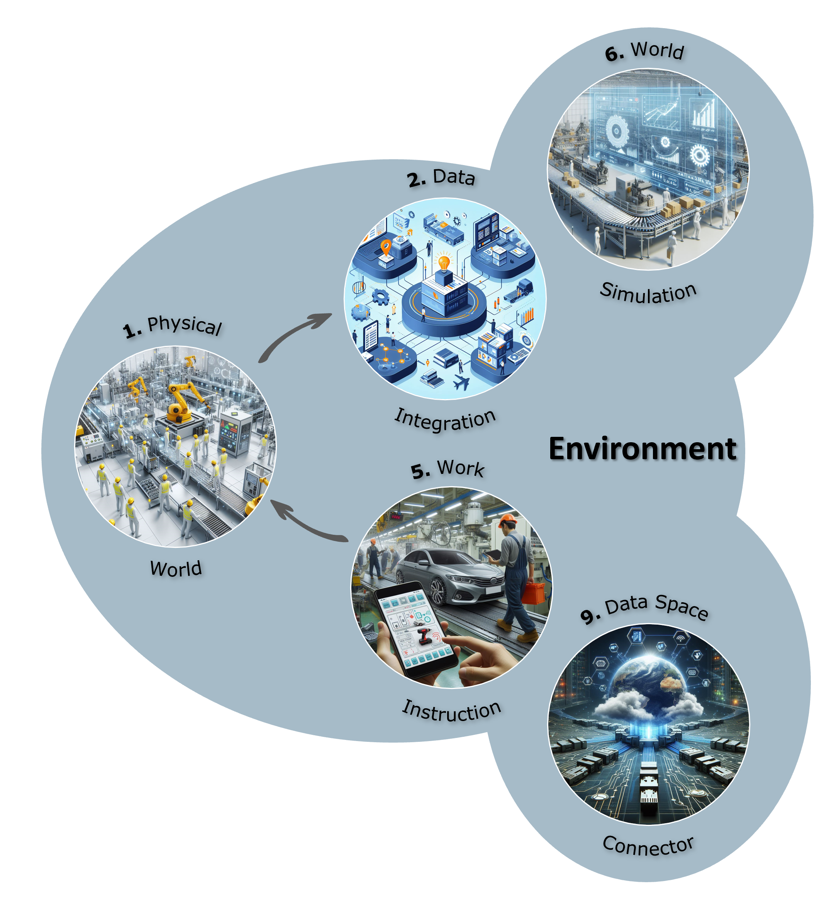

# Environment

The OFacT environment serves multiple critical functions in bridging the gap between physical and digital operations. First and foremost, it acts as a **Digital Twin Model generator**, creating virtual representations of physical assets and processes. Simultaneously, it serves as the interface between the physical (real) world and the virtual (digital) world, acting as a bidirectional platform that both receives and outputs data. On the one side to integrate new data, on the other to provide decisions (e.g. work plans) for the physical world. Beyond this, the OFacT environment provides a simulation world that enables virtual scenario trials to simulate real-world conditions before implementation. Additionally, it functions as an **interface to other virtual systems**, enabling data exchange in both directions to support data-driven decision-making in near real-time (Data Space - a standardized framework for secure data exchange).

At the heart of these modules lies the **Digital Twin Core**, which both consumes input from and provides output to the OFacT environment. The Core, consisting of the agent control and the state model and takes also the output of the decisions made. The **Agent Control** comprises intelligent control units that make decisions, while the **State Model** provides a digital representation of the current system or facility state.

The bidirectional information flow operates as follows: Data coming directly from sensors, Manufacturing Execution System (MES), Enterprise Resource Planning (ERP) systems and others is taken as input to the data integration module to generate a first Digital Twin Model on historic data. After validation of the Digital Twin Model, it can be continuously updated and validated in the data integration module to ensure a current state of the digital model. Based on this current state, the Agent Control makes informed decisions and formulates them as work instructions, such as work plans. These instructions are then transmitted back to the physical world and executed there, creating a closed control loop. Simultaneously, the environment can run virtual scenario simulations to test potential changes or optimize processes before deploying them in the physical world. This capability, combined with the possibility to interact with other virtual systems, enables comprehensive, data-driven decision-making that responds to changing conditions in near real-time.

## Example

Consider a typical production scenario where multiple disruptions occur simultaneously: A machine breakdown is detected on the main assembly line (input from physical world via sensors), while the HR system reports an employee absence due to illness (input from virtual system), and real-time monitoring identifies a developing bottleneck at the packaging station due to increased throughput from the previous shift. The Agent Control immediately analyzes the impact on material flow in the Digital Twin Core and runs virtual scenario simulations to evaluate alternative production strategies – such as rerouting material to a secondary machine, redistributing tasks among available personnel, or adjusting production priorities. Based on the simulation results and consultation with the ERP system for inventory levels and order priorities (interface to virtual systems), the agents determine the optimal response strategy. The system then generates work instructions: maintenance is dispatched to the broken machine, production supervisors receive adjusted work schedules for remaining staff, and material flow is automatically rerouted to prevent the bottleneck from escalating (output to physical world). Throughout this process, the OFacT environment continuously monitors the effectiveness of these interventions, adjusting plans in near real-time as conditions evolve, thus ensuring continuous synchronization across physical and virtual domains while minimizing production disruption.