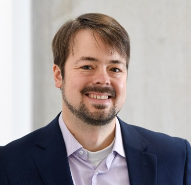
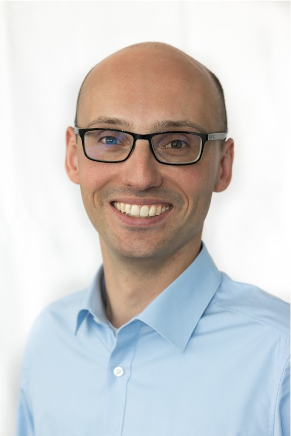

***

## Table of Contents

- [About](#about)
- [Structure](#structure)
- [Getting Started](#getting-started)
    - [System Prerequisites](#system-prerequisites)
    - [Quick Start](#quick-start)
- [Release Notes](#release-notes)
- [Contributing](#contributing)
- [License](#license)
- [Developers](#developers)

***

## About

The *Open Factory Twin* (OFacT) project aims to provide a digital twin for production and logistics environments.
Digital Twins (DT) represent their environment as a virtual model of all relevant parts of the real system. OFact 
is meant to support the design, planning and operation control of discrete material flow systems and thus supporting 
management of the system during the whole life cycle.     

Coming from the **challenges** such as ...

* shorter production life cycles
* frequently changing demands
* complex supply chains
* increasing number of possible product variants
* regulations, legal requirements and restrictions

... companies are faced constantly with a complex decision that often needs a dynamic evaluation and comparison of various
scenarios. Often detailed simulation models are the only way to get a reliable evaluation of costs and performance. Data 
of the real world has to be integrated regularly into the simulation models to keep them up-to-date.  
In the design (or re-design) phase of a production system, the digital twin can be used to simulate different design 
alternatives and evaluate them even before the real system exists. When the real system is in operation, the digital twin
can be used in an iterative way between planning orders and resources and controlling the plan during operations dealing 
with disruptions in real time.

OFacT is based on a general state model that describes the state of the factory and the possible behaviors and can be 
used for all kinds of discrete material flow systems (e.g. assembly lines, flexible matrix production, job shops,
warehouses or even supply networks). 
The model consists of the following basic elements:
* **orders** (that describe the "customer" demand)
* **entities** (**resources** and **parts**) that describe the physical objects in the system with parts being
transformed based on processes that are executed by reusable resources 
* **processes** define the possible transformation of parts (and sometimes resources) in time, space physical attributes 
and quality

While the processes describe the possibility space of the material flow system, (planned and actual) **process executions** 
describe the concrete transformation in the past, present and future and can be seen as event logs that capture the 
dynamic behavior of the system. Process executions can be created by the real system - planned process execution are 
generated based on data from planning systems such as ERP or APS systems while actual process executions are generated 
based of sensor or event data. Planned process executions can also be created by the **multi-agent system** that controls 
the state model. The control logic of the digital twin is realised by agent behaviours and thus separated from the static
state model allowing for complex and flexible control behaviours. The separation of possibility space and actual behavior
as well as the separation of state mode and agent-based control allows for a flexible and modular design of the digital
twin that can be adapted to the specific requirements of the production system. Even more it facilitates the learning
of the model from the data of the real system. 

<div align="center">
  
  <h3>Digital Twin Ecosystem</h3> 
</div>

The OFacT framework consists of the following super components:
- **Environment**: provides components to interact with all kinds of environments (real and virtual) and to integrate data
  - **Data Integration**: provides tools to integrate data into the digital twin including consistency checks and update
  mechanisms
  - **Work Instruction**: provides tools to pass work instructions (planned process executions) back to the physical 
  world (closed loop system)
  - **Simulation**: is a virtual environment, that mimics the behavior of the real world and can be used to evaluate
    different scenarios or produce forecasts
  - **Data Space Connector**: provides the tools to connect the digital twin to the data space and to share the digital
    twin with other companies
- **Digital Twin**: provides the state model, the agent control
  - **State Model**: describes the state of the factory and the possible behaviors as well a passed and planned transformations
  - **Agent Control**: provides the control logic of the digital twin based on order and resource agents
- **Planning Services**: provides tools to generate the state model and to create and evaluate scenarios
  - **Scenario Generation**: provides the capabilities to create difference scenarios based on manual parameter variation, 
  optimization or even Artificial Intelligence such as reinforcement learning agents or generative models
  - **Scenario Analytics**: provides the tools to determine KPI's based on the state model, visualize and compare them

***

## Structure

This project uses a [monolithic repository approach](https://en.wikipedia.org/wiki/Monorepo) and
consists of different parts that are located in different subfolders of the `ofact` folder. 
Examples are use case-specific models and adaptions (currently only the twin models) 
are offered in the `projects` folder.

***

## Getting Started

Detailed getting started guides are described for every component in their dedicated `README`
file, located in the corresponding subfolders.

### System Prerequisites

The following things are necessary to run this application:

- tested on Python 3.12
- requirements.txt

### Quick Start

The first release of the open factory twin contains the data model (digital twin state model component) 
and therefore next to the agent control, one of the two core elements of the digital twin.
The state model can be filled with two sample use cases that can be found in the `projects` folder:
The models are provided in the `{project_name}/model/twin/` folder, modeled in Excel files.

```
Coming soon..

#### Tutorial

The tutorial shows a small example shop floor of a board game factory 
that contains a subset of the elements existing in the state model.
In this example, three parts are taken from a warehouse and assembled by a worker in a packing station.

In this tutorial four topics are introduced:
1. Modelling
2. Data Integration
3. Analytics
4. Simulation

To start with the tutorial, click [here](projects/tutorial/A%20Warm%20Welcome%20to%20OFacT!.ipynb).

Some parts of the tutorial already contains the bicycle world, a more complex scenario ...

#### Bicycle World

A more advanced scenario in the context of Industrie 4.0 is offered with the bicycle world. 
Here, a modular and flexible assembly produces customized bicycles. 
The assembly stations can execute one or more processes (standardized),  
and the main product has a flexible assembly step sequences (routing flexibility), 
restricted only by the assembly priority chart of each product.
This projects contains two variants, one with and one without material supply.

---

## Release Notes

As stated before, the first release, contains only the data model (state model).
However, soon further parts of the project will become open source.
The aim is to offer an example case (bicycle world) that can be simulated (agent control) 
and analyzed (scenario analytics).

---

## Contributing

Contributions to this project are greatly appreciated! 
For more details, see the `CONTRIBUTING.md` file.

---

## License

This work is licensed under the Apache 2.0 license. 
See `LICENSE` file for more information.

In the meantime, the project was created within the scope of
the [Center of Excellence Logistics and It](https://ce-logit.com/).

---

## OFacT Team

<style>
.team-scroll-container {
  overflow: hidden;
  padding: 2rem 0;
  background: var(--md-code-bg-color);
  margin: 2rem -1rem;
  border-radius: 1rem;
  position: relative;
}

.team-scroll-wrapper {
  display: flex;
  animation: scroll-left 20s linear infinite;
  gap: 2rem;
}

.team-scroll-wrapper:hover {
  animation-play-state: paused;
}

@keyframes scroll-left {
  0% {
    transform: translateX(100%);
  }
  100% {
    transform: translateX(-100%);
  }
}

.team-member {
  flex: 0 0 auto;
  background: var(--md-default-bg-color);
  border-radius: 1rem;
  padding: 1.5rem;
  text-align: center;
  box-shadow: 0 4px 16px rgba(0,0,0,0.1);
  border: 1px solid var(--md-default-fg-color--lightest);
  min-width: 280px;
  transition: transform 0.3s ease;
}

.team-member:hover {
  transform: scale(1.05);
}

.team-avatar-small {
  width: 80px;
  height: 80px;
  border-radius: 50%;
  margin: 0 auto 1rem;
  background: var(--md-primary-fg-color);
  display: flex;
  align-items: center;
  justify-content: center;
  font-size: 1.8rem;
  color: var(--md-primary-bg-color);
  font-weight: bold;
}

.team-avatar-small img {
  width: 100%;
  height: 100%;
  border-radius: 50%;
  object-fit: cover;
}

.team-name-small {
  font-size: 1.2rem;
  font-weight: 700;
  color: var(--md-primary-fg-color);
  margin-bottom: 0.5rem;
}

.team-role-small {
  font-size: 0.9rem;
  color: var(--md-default-fg-color--light);
  margin-bottom: 1rem;
  font-weight: 500;
}

.team-institutions {
  display: flex;
  gap: 0.5rem;
  justify-content: center;
  flex-wrap: wrap;
}

.institution-badge {
  display: inline-block;
  padding: 0.3rem 0.8rem;
  background: var(--md-primary-fg-color--light);
  color: var(--md-primary-bg-color);
  border-radius: 1rem;
  text-decoration: none;
  font-size: 0.8rem;
  font-weight: 500;
  transition: all 0.3s;
}

.institution-badge:hover {
  background: var(--md-primary-fg-color);
  transform: translateY(-2px);
}

/* Dupliziere den Content für seamless loop */
.team-scroll-wrapper::after {
  content: '';
  flex: 0 0 2rem;
}
</style>

<div class="team-scroll-container">
  <div class="team-scroll-wrapper">
    <!-- Christian Schwede -->
    <div class="team-member">
      <div class="team-avatar-small">
        
      </div>
      <div class="team-name-small">Christian Schwede</div>
      <div class="team-role-small">Senior Researcher & Project Lead</div>
      <div class="team-institutions">
        <a href="https://www.hsbi.de/en" class="institution-badge" target="_blank">HSBI</a>
        <a href="https://www.isst.fraunhofer.de/en.html" class="institution-badge" target="_blank">Fraunhofer ISST</a>
      </div>
    </div>
    
    <!-- Jan Cirullies -->
    <div class="team-member">
      <div class="team-avatar-small">
        
      </div>
      <div class="team-name-small">Jan Cirullies</div>
      <div class="team-role-small">Senior Researcher & Project Lead</div>
      <div class="team-institutions">
        <a href="https://www.fh-dortmund.de/index.php?loc=en" class="institution-badge" target="_blank">FH Dortmund</a>
        <a href="https://www.isst.fraunhofer.de/en.html" class="institution-badge" target="_blank">Fraunhofer ISST</a>
      </div>
    </div>

    <!-- Adrian Freiter -->
    <div class="team-member">
      <div class="team-avatar-small">
        
      </div>
      <div class="team-name-small">Adrian Freiter</div>
      <div class="team-role-small">Researcher & Software Engineer</div>
      <div class="team-institutions">
        <a href="https://www.isst.fraunhofer.de/en.html" class="institution-badge" target="_blank">Fraunhofer ISST</a>
      </div>
    </div>

  </div>
</div>

- Roman Sliwinski ([HSBI](https://www.hsbi.de/en))
- Jannik Hartog ([Fraunhofer ISST](https://www.isst.fraunhofer.de/en.html))

- Niklas Müller ([Fraunhofer ISST](https://www.isst.fraunhofer.de/en.html))

---

If you have any further questions, please do not hesitate to contact us:

- christian.schwede@isst.fraunhofer.de
- adrian.freiter@isst.fraunhofer.de

---

## Notice
The documentation part of this work is 
licensed under the [CC-BY-4.0](https://creativecommons.org/licenses/by/4.0/legalcode) while the software part is 
licensed under Apache 2.0.