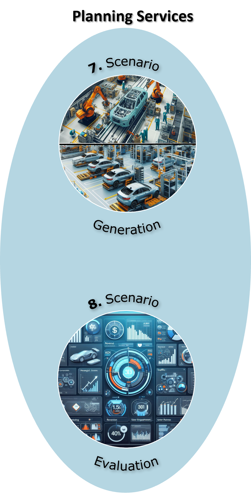

# Planning Services

  

The OFacT Planning Services build upon the Digital Twin Core, providing users with powerful tools for scenario-based planning and optimization. These services enable users to create and configure multiple simulation scenarios with different parameters (**Scenario Generation**), allowing them to explore various what-if situations before making real-world decisions. Each scenario can be evaluated against defined Key Performance Indicators (KPIs), such as delivery reliability, resource utilization, throughput rates, or production costs (**Scenario Evaluation**). Here the planner systematically compare multiple scenarios side-by-side and select the option that best meets their operational objectives, significantly reducing planning time while improving decision quality.

The system leverages two core modules: the **Scenario Generation Module**, which creates alternative configurations based on user inputs or automated optimization algorithms, and the **Scenario Evaluation Module**, which provides calculated KPIs for each scenario. By combining these modules, a **Scenario Optimization** module can automate and optimize what would otherwise be a time-consuming manual planning process. Instead of relying on trial-and-error or experience-based decisions alone, planners can trust on the optimization module (e.g., a genetic algorithm).

## Example

A planner can create scenarios that modify worker availability plans to assess the impact of different shift schedules, vacation planning, or staffing levels on production performance. By simulating each configuration, the system reveals how changes in workforce availability affect delivery reliability and overall throughput, enabling data-driven staffing decisions.