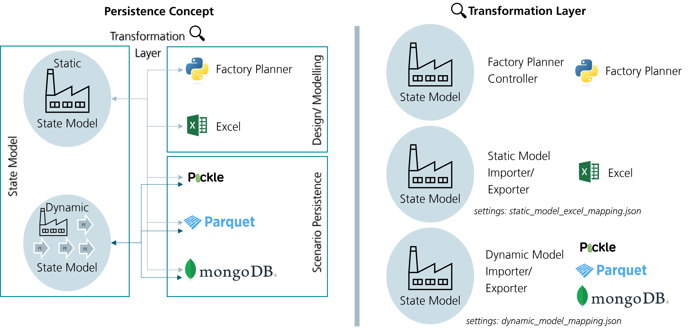

# Persistence

## State Model Persistence



In general, persistence is differentiated between static and dynamic state models.
Some reasons can be found for the differentiation:
 - Static models are mainly used in the modelling/ designing phase, which requires more interaction with the model. 
   Therefore, interaction with Excel files by the user is preferred.
 - Since the dynamic model arises with time considered (real world, simulation), the amount of data also enriches. 
 - In the usage phase, faster alternatives are preferred. 
   Since the interaction is stepped in the background, pickle files are preferred.

The high amount of cross-references in the state model makes it impossible to simply store the data in pickle files. 
A transformation/ serialization is required to transform the python objects into capsuled objects 
without direct links to other state model objects.

Static State Model (Excel) Mapper json file
```json
{
  "target_schema": "xlsx",                  - resulting file type
  "reference_type": "label",                - label means that the labels/ static model ids are used as reference
  "sources": [                              - parameters of the state model python object 
    {
      "source": "entity_types",             - a parameter of the state model python object
      "serialization_kind": "list",         - the type of the parameter value
      "serialize_unique": false,            - states if the object is unique or can have duplicates
      "classes": [                          - classes allowed in the parameter value
        "EntityType",
        "PartType"
      ],
      "drop": [                             - value parameters that are droped (e.g., "identification" is always 
        "identification"                       dropped and set again in the import)
      ]
    },
    ...
    ], 
  "sheets": [                               - sheets of e.g., the excel file
    {
      "name": "EntityType",                 - name of the excel file sheet
      "classes": [                          - classes inside the excel sheet
        "EntityType",
        "PartType"
      ],
      "columns": [                          - columns inside an excel sheet
        {
          "column_kind": "type",            - ToDo ???
          "description": "description",     - Describes the column/ parameter 
          "notation": "notation",           - States the notation of the parameter
          "example": "example",             - Gives a modelling example 
          "mandatory": "mandatory",         - States if the parameter is mandatory
          "name": "index",                  - Name of the parameter
          "format": "string"                - format of the parameter (ToDo: required in export?)
        },
	    ...
	    ],
	],
}
```

Dynamic State Model Mapper json file
```json
{
  "target_schema": "pkl",                   - resulting file type
  "reference_type": "identification",       - label means that the labels/ static model ids are used as reference
  "sources": [                              - parameters of the state model python object 
    {
      "source": "entity_types",             - a parameter of the state model python object
      "serialization_kind": "list",         - the type of the parameter value
      "serialize_unique": false,            - states if the object is unique or can have duplicates
      "classes": [                          - classes allowed in the parameter value
        "EntityType",
        "PartType"
      ],
	 {
		"source": "plant",
		"serialization_kind": "single_value",
		"serialize_unique": false,
		"classes": ["Plant"],
		 "drop": [                          - value parameters that are droped 
        "work_calendar"
      ]
	},
    ...
    ], 
}
```

# How To Serialize DigitalTwin

During the WS 23/24 we have written a Serializer for the digital twin. The Serializer is able
to serialize the digital twin into a JSON file or an excel.
There existed an old serializer to the excel format, but it was not able to serialize new
attributes of the digital twin. The new serializer is able to serialize all attributes of the
digital twin. Most of them are serialized automatically with default methods. All classes
should have a dict_serialize method now, which is used to serialize objects of this class.
In the following the development process is described.


## Requirements
------------
1. The serializer should be able to serialize all attributes of the digital twin to an excel file format.
2. Newly added attributes should be serialized automatically or throw a warning.
3. An importer for the excel files already exists. The serializer should be able to serialize the digital twin
   in the same format as the importer expects it. The importer can be fitted, but this is a complicated process.


## Solution Design
---------------
A new serializer class is added to the project (Serializable). This class provides basic functionality needed for the serialization. Each class which needs to be serialized (e.g. the digital twin) inherits from this class. The class provides some methods for serialization objects:

1. serialize_dict: Serializes a dictionary. Checks on each item in the dictionary if it has dict_serialize. If this is the case the item is serialized. Same for the keys.
2. serialize_list: Calls dict_serialize on the list elements and returns a list of serialized elements.
3. serialize_2d_numpy_array: Serializes a 2d numpy array. Checks on each item in the array if it has dict_serialize. If this is the case the item is serialized.
4. serialize_list_of_tuple: Serializes a list of tuples. Checks on each item of the tuples in the list if it has dict_serialize. If this is the case the item is serialized.
5. dict_serialize: The main method of the class. Serializes the dict representation of a class to a json serializable dictionary. This method can and for the most classes should be overwritten, since at the current state it does not serialize the items in the dictionary. It only checks if the object has already been serialized (to avoid endless loops) and adds some items to the dictionary (version number of the serializer, object_type and a label). It has the option to remove private attributes from the dictionary. And lastly it has the option to drop specified attributes. (The subclass needs to have a attribute drop_before_serialization).
6. remove_private: Mainly used by dict_serialize. Removes private attributes (starting with at least one underscore) from a dictionary.
7. to_json: Calls dict_serialize internally. Then parses the returned dictionary to a json.
8. check_key_value_in_dict: Checks whether a key value pair is in a dict. Can be used to check whether an attribute has been serialized. Mainly used by dict_serialize. Public to allow specific implementations of dict_serialize in subclasses and checking for correct serialization of attributes.
9. warn_if_attributes_are_missing: Interface to check if all attributes have been serialized. Should be called at the end of every implementation of the dict_serialize.

Each class of the digital twin must provide a dict_serialize method. This method should serialize all attributes of the class. Attributes can be ignored by specifying them with their name in a list called drop_before_serialization as a class attribute. For complex attributes (which are not serializable by the json module) the method should call dict_serialize on them directly if possible. Otherwise most of the times some of the provided methods (see above) can be used. If not a custom implementation must be provided. The method should return a dictionary with the serialized attributes. The method should also call warn_if_attributes_are_missing at the end to check if all attributes have been serialized. If this is not the case a warning (Type: SerializableWarning) is thrown.
A simple implementation can look like the following:


```py title="entities.py" linenums="1"
class Entity(DynamicDigitalTwinObject, Serializable):
    drop_before_serialization = ['dynamic_attributes']
    further_serializable = ['_entity_type', '_process_execution', ]

    ...

    def dict_serialize(self, serialize_private: bool = True,
                   deactivate_id_filter: bool = False,
                   use_label: bool = False,
                   use_label_for_situated_in: bool = True) -> Union[dict | str]:
        """
        Creates a dict representation of the object.
        Also serializes object in attributes by calling the function on them.

        :param serialize_private: Whether to serialize the private attributes.
            Defaults to True.
        :param use_label: Whether to use the label as only identifier of the object. Then a string is returned.
        :param use_label_for_situated_in: If set to true, only the static model id is used for the situated_in attribute
            of this class.
        :param deactivate_id_filter: Whether to check if an obj has already been serialized.
            Then the static model id is used. Defaults to False.

        :return: The dict representation of the entity type or the static model id.
            If use_label is set to true a str is returned.
        """
        object_dict = super().dict_serialize(serialize_private=serialize_private,
                                             use_label=use_label,
                                             deactivate_id_filter=deactivate_id_filter)
        # Check if only the label is returned
        # Could be the case because use_label is true
        # or because the object has already been serialized and the id filter is active
        if isinstance(object_dict, str):
            return object_dict

        # Here a special serialization of the situated_in attribute is done
        # This attribute leads to and endless loop most of the time, so only the label is
        # used. This could also be moved to the dict_serialize of Serializable in the
        # future. This has to be done for many classes.
        # Also some attributes are serialized by calling dict_serialize on them. These are also specified in a class  attribute (further_serializable). This is also a candidate to be moved to the dict_serialize of Serializable.
        for key, value in object_dict.items():
            if key == '_situated_in' and value is not None:
                if use_label_for_situated_in:
                    object_dict[key] = value.get_static_model_id()
                else:
                    object_dict[key] = value.dict_serialize()
            elif key in self.further_serializable and value is not None:
                object_dict[key] = value.dict_serialize()

        # Check if attributes are missing
        Serializable.warn_if_attributes_are_missing(list(self.__dict__.keys()),
                                                    ignore=self.drop_before_serialization,
                                                    dictionary=object_dict)
        return object_dict
```

Like this the serializer is able to serialize all attributes of the digital twin.
In the next step there are two possible ways to save the serialization. The first case is a json file. At the moment this is useless, but was implemented for future use, since json is platform and programming language independent. The second case is an excel file. This is the format the importer expects. The excel file is created by the twin_exporter.py and the format can be specified in a json. This allows easy modification of the excel file in the future, without modification of the exporter itself. The expected format for the importer is already created as a json and can be found at:
    ./DigitalTwin/application/repository_services/default_aligned_mapping.json
The exporter itself and the format of the json is documented in ....

## Future Work
-----------
1. The default implementation dict_serialize, should be able to serialize some more special attributes automatically. For example the numpy arrays, dicts, lists, etc. Most of the necessary methods have already been implemented. This would allow to remove the dict_serialize method from most of the subclasses and just use the default implementation from the superclass. This is in theory an easy task, but in practice it is quite difficult, since the serializer is quite complex and it is not easy to check if the changes broke the serializer. It is also difficult to pinpoint the exact place where the changes broke the serializer. Since the output json is quite big and the excel only shows top level attributes and not the hierarchy.
2. More Testcases should be added (some are added from Adrian), to check if changes broke the serializer. Since the serializer is quite complex, breaking changes should be detected as early as possible.
3. The warning system should be improved. At the moment the warning is only thrown if an attribute is not serialized and **removed** from the dict and also the warning does not include information about the missing attribute and object. If it is not removed no warning is thrown (but probably if it is an important attribute an exception when trying to convert it to a json or excel) This should be improved. The warning should also be thrown if the dictionary representation includes attributes which are not a type supported by the json module (this means they are not serialized yet). This is quite complicated, since this needs to be checked recursively as well, however shouldn't be checked for attributes serialized by a subclass twice. The object could have an attribute which is a list and in the list are dicts and some value of the dict is not serialized yet. This is why we went the easy route at the beginning and only the check if each attribute is included in the keys of the dict. Time was at a premium. The implementation of the serializer for the complete digital twin and fitting to the importer needed a lot of time.
4. Move serialization of attributes like situated_in to the default implementation of dict_serialize.


# Exporter

The overall idea is to write an exporter that takes in a mapping file
that constitutes the target schema type and the structure of the schema
originating in the source object (i.e. the ``DigitalTwin`` object) which
implements ``dict_serialize``. If the target schema is *xlsx* the
mapping file should provide a *sheets* attribute that is a list of all
sheets with its corresponding columns and mappings to the source object.
A column mapping would consist of the column name as the key and the
keys needed to access the value in the source object. When a list is
provided the source object is accessed incrementally. I.e.
``["entity_type", "name"]`` would lead to
``source["entity_type"]["name"]``. The accessed value is stringified
subsequently and written to the target table.

## Defining sheets

By defining the ``target_schema`` as *xlsx* a *sheets* attribute can be
provided as a list of sheets that should be included in the output of
the exporter. A sheet definition follows the following scheme:

::

   serialization_kind: "dict_flatten" | "list" | "single_value" | "mixed"
   serialize_unique: bool
   name: string
   source: string | list string
   filter: string
   source_function: string
   columns: list column
   start_row: int

### Serialization kind

To address different types of source attributes for serialization a
serialization kind is introduced:

-  ``"serialization_kind" : "dict_flatten"`` -> Accepts source
   attributes of type ``dict[any, list[Serializable]]`` and flattens the
   ``dict`` whose keys map to lists to a single list. The list is
   serialized into the sheet
-  ``"serialization_kind" : "list"`` -> Accepts source attributes of
   type ``list[Serializable]`` and serializes them directly to a table.
-  ``"serialization_kind": "single_value"`` -> Accepts a source
   attribute that is ``impl Serializable`` and writes it to the target
   file. This is equivalent to ``"list"`` where the source list has one
   entry.
-  ``"serialization_kind": "mixed"`` -> Accepts a source attribute that
   either meets the criteria of ``dict_flatten`` or ``list`` and reduces
   them to a single list which is being written to the target file.

### Serialize unique

When ``serialize_unique`` is set to ``True`` the table only consists of
unique values with an additional column ``amount`` that represents the
amount of identical entries in the source.

### Source

When a string is provided the provided input object is indexed by the
string and is subsequently used as the source for the sheet. Providing a
list of strings multiple source attributes of the input object can be
used for the same sheet.

### Filter

For each sheet a ``filter`` function can be provided to filter the
source attribute. The filter function has to be supported by the
exporter. The function has to return either ``True`` or ``False``.

### Source function

Source attributes can be mapped using a source function. The source
function has to be supported by the exporter.

### Start row

Specifies the first row which is used for writing to the target table.

## Columns

A list of columns for the respective sheet. A column definition follows
this schema:

::

   column_kind: "simple" | "complex" | "fixed_value" | "generate" | "type"
   name: string
   function: string
   indexing_strategy: list string
   header: string

### Column kind

The provided column kind tells the exporter how to handle elements in
the list originating from the serialization kind of the source
attribute. - Column kind ``type`` uses the ``indexing_strategy`` to
iteratively index the element and writes the type of the element as
values into the respective rows. - Column kind ``simple`` uses the
``indexing_strategy`` to iteratively index the element and writes the
output to the target table. - Column kind ``complex`` uses the
``indexing_strategy`` to index the individual elements and applies a
function to them - Column kind ``fixed_value`` writes a fixed value for
each element into the column of the target table. - Column kind
``generate`` identifies each individual unique value resulting from
indexing all elements and generates a new column for each of the unique
values. Subsequently, the rows are filled with the count that results
from counting the items in the element that matches the respective
column.

### Name

The column name that appears in the target table. Not needed for
``column_kind = "generate"``.

### Function

The function that is applied to each individual element when
``column_kind = "complex"``.

### Indexing strategy

A list of keys that are iteratively used to index each individual
element, i.e. ``indexing_strategy = ["hello", "world"]`` the element
would be indexed as follows: ``el["hello"]["world"]``

### Header

An optional attribute that lets you specify whether columns should be
grouped. Columns with the same header are grouped together appearing
next to each other with an additional header in the target table.

Example:

.. code-block:: json

    {
      "target_schema": "xlsx",
      "sheets": [
        {
          "serialization_kind": "dict_flatten",
          "serialize_unique": true,
          "name": "StationaryResource",
          "source": "stationary_resources",
          "columns": [
            {
              "column_kind": "fixed_value",
              "name": "index",
              "value": "StationaryResource"
            }
          ]
        }
      ]
    }
