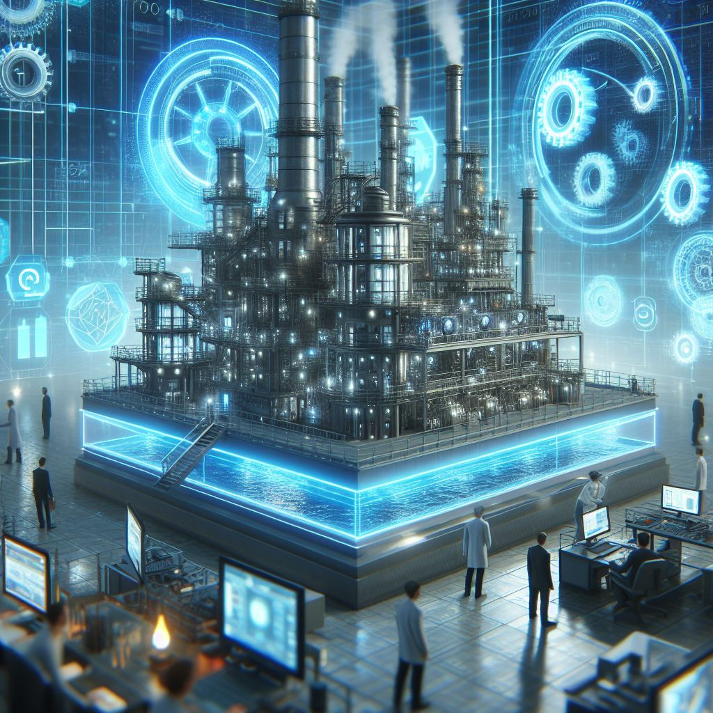

    <h3>Model Generation</h3>
    

The model generation is used to create especially the state model of the digital twin.
But also used for the agents model.

To generate the state model, the initial state must be modelled.
This initial state contains the resources on the shop floor as well as 
the possible behavior of the real world shop floor.

For the modelling, mainly two tools can be used, Excel files and the factory planner.

Firstly, the factory planner GUI.
The factory planner is used as interface to the state model and provides more structure.
Consequently, beginners should start with the factory planner to get in touch with the model.

Secondly, excel that provides the maximal flexibility and is used by the more advanced users.
