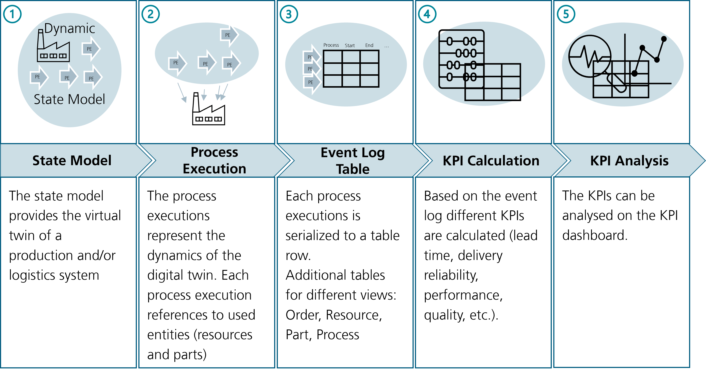
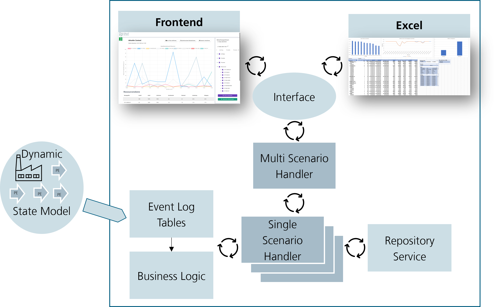
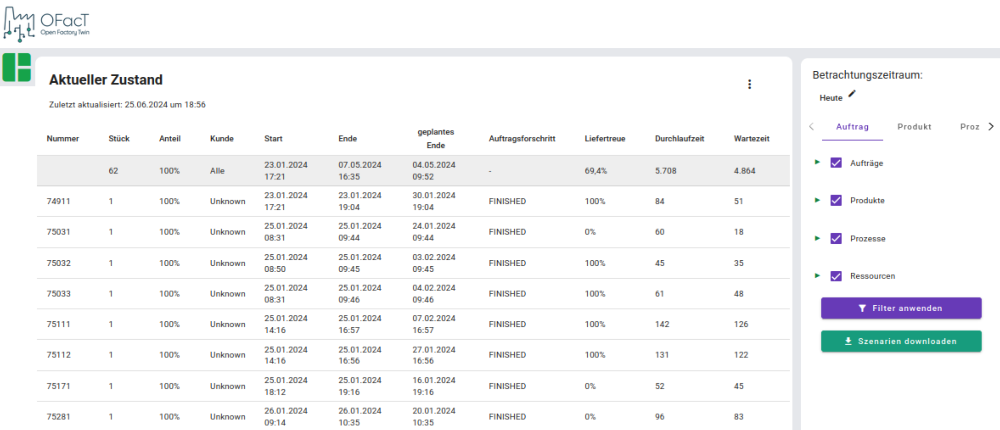

# Scenario Analytics with OFacTAna

  
  <h3>KPI and Schedule Analytics</h3> 

The scenario analysis component is part of the planning services.
This means that it is intended as a component for contact with the user.
Especially for the production planner or controller, but actually only the frontends.

The component is used to analyze one to n scenarios.
Analysing means in this context to calculate Key Performance Indices (KPI's), create schedules etc.
Based on these scenario analyzes, they can be compared to each other.

## Integration in the ecosystem

The OFacTANA (scenario analytics) component is based on the state model.
It takes the process executions from the state model
and creates for each process execution a data row entry in the event log table.
Since each process execution has references to the associated entities (resources, parts, processes, orders),
all required information can be extracted from the process executions.
Given the event log table, KPIs can be calculated and presented on the dashboard.

  
  <h3>Analytics Workflow</h3> 

### Event Log Tables

Coming deeper, a single table is not enough.

| Table                      | Brief Summary                                                                           |
|----------------------------|-----------------------------------------------------------------------------------------|
| Process Execution          | Each row contains a process execution.                                                  |
| Process Execution Order    | Each row contains a feature, order and process execution combination.                   |
| Process Execution Part     | Each row contains a part and process execution combination.                             |
| Process Execution Resource | Each row contains a resource and process execution combination.                         |
| Order                      | Each row contains an order.                                                             |
| Resource Inventory         | Each row contains a storage, stored entity, quantity and process execution combination. |
| Digital Twin               | Combines the process execution tables                                                   |

#### Process Execution

The process execution table contains all process executions of the state model.

| Column Name                            | Description                                                                      |
|----------------------------------------|----------------------------------------------------------------------------------|
| Process Execution ID (int32)           | Unique Identification of the Process Execution (Reference for all other columns) |
| Event Type (str)                       | PLAN or ACTUAL (np.nan if not available)                                         |
| Start Time (datetime64[ns])            | Start Time of the Process Execution                                              |
| End Time (datetime64[ns])              | End Time of the Process Execution                                                |
| Process ID (int32)                     | Unique Identification of the Process                                             |
| Process Name (str)                     | Name of the Process                                                              |
| Process Type (str)                     | Process or ValueAddedProcess                                                     |
| Process Category (str)                 | Main Material Flow (Order) or Supporting Material Flow (...)                     |
| Resulting Quality (float)              | Resulting Quality of the Process Execution                                       |
| Main Resource ID (int32)               | Main Resource executed the Process                                               |
| Origin ID (int32)                      | Origin Resource from the Process Execution                                       |
| Destination ID (int32)                 | Destination Resource from the Process Execution                                  |
| Order ID (int32)                       | Unique Identification of the Order associated with the Process Execution         |
| Source (str)                           |                                                                                  |
| Connected Process Execution ID (int32) |                                                                                  |

#### Process Execution Order

The process execution table contains all process executions of the state model

| Column Name                  | Description                                                                         |
|------------------------------|-------------------------------------------------------------------------------------|
| Process Execution ID (int32) | Unique Identification of the Process Execution (Reference for all other columns)    |
| Order ID (int32)             | Unique Identification of the Order associated with the Process Execution            |
| Order Name (str)             | Name of the Order associated with the Process Execution                             |
| Order Identifier (str)       | Identifier of the Order coming from physical world                                  |
| Feature Requested ID (int32) | Unique Identification of the feature processed by the Process Execution             |
| Feature Requested Name (str) | Name of the feature processed by the Process Execution                              |
| Customer ID (int32)          | Unique Identification of the customer demand the product processed by the execution |
| Customer Name (str)          | Name of the customer demand the product processed by the execution                  |

#### Process Execution Part

The process execution table contains all process executions of the state model

| Column Name                         | Description                                                                                  |
|-------------------------------------|----------------------------------------------------------------------------------------------|
| Process Execution ID (int32)        | Unique Identification of the Process Execution (Reference for all other columns)             |
| Part Involved ID (int32)            | Unique Identification of the Part processed in the Process Execution                         |
| Part Involved Name (str)            | Name of the Part processed in the Process Execution                                          |
| Part Transformation Node ID (int32) | Unique Identification of the Transformation Node processed the part in the Process Execution |
| Entity Type ID (int32)              | Unique Identification of the Entity Type from the Part                                       |
| Entity Type Name (str)              | Name of the Entity Type from the Part                                                        |

#### Process Execution Resource

The process execution table contains all process executions of the state model

| Column Name                       | Description                                                                                            |
|-----------------------------------|--------------------------------------------------------------------------------------------------------|
| Process Execution ID (int32)      | Unique Identification of the Process Execution (Reference for all other columns)                       |
| Resource Used ID (int32)          | Unique Identification of the Resource executing the Process                                            |
| Resource Used Name (str)          | Name of the Resource executing the Process                                                             |
| Resource Type (str)               | Type (class name) of the Respirce executing the Process                                                |
| Superior Resource Used ID (int32) | Unique Identification of the superior Resource executing the Process (e.g., StoragePlace -> Warehouse) |

#### Order

The order table contains all orders of the state model

| Column Name                            | Description                                                                |
|----------------------------------------|----------------------------------------------------------------------------|
| Order ID (int32)                       | Unique Identification of the Order (Reference for all other columns)       |
| Order Name (str)                       | Name of the Order associated with the Process Execution                    |
| Order Identifier (str)                 | Identifier of the Order coming from physical world                         |
| Release Date (datetime64[ns])          | Release Date of the Order                                                  |
| Delivery Date Planned (datetime64[ns]) | Delivery Date Planned of the Order                                         |
| Delivery Date Actual (datetime64[ns])  | Delivery Date Actual of the Order                                          |
| Customer ID (int32)                    | Unique Identification of the Customer associated with the Order            |
| Customer Name (str)                    | Name of the Customer associated with the Order                             |
| Product ID (int32)                     | Unique Identification of the Product associated with the Order             |
| Product Entity Type ID (int32)         | Unique Identification of the Product Entity Type associated with the Order |

#### Storage Inventory

The resource inventory table contains all resource inventories of the state model

| Column Name                          | Description                                                                           |
|--------------------------------------|---------------------------------------------------------------------------------------|
| Process Execution ID (int32)         | Unique Identification of the Process Execution (Reference for all other columns)      |
| Event Type (str)                     | PLAN or ACTUAL (np.nan if not available)                                              |
| Storage Resource ID (int32)          | Unique Identification of the storage, an entity is stored (add) or extracted (remove) |
| Superior Storage Resource ID (int32) | Unique Identification of the superior resource of the storage resource                |
| Part ID (int32)                      | Unique Identification of the part stored/ extracted from the storage resource         |
| Part Type ID (int32)                 | Unique Identification of the part type stored/ extracted from the storage resource    |
| Resource ID (int32)                  | Unique Identification of the resource stored/ extracted from the storage resource     |
| Timestamp (datetime64[ns])           | Timestamp the storing/extraction take place                                           |
| Quantity (int32)                     | Quantity sored/extracted                                                              |

#### Digital Twin

The digital twin table contains all process execution tables concatenated together

## Architecture

The scenario analytics component contains two user interaction points, as depicted on the figure below.
Both of these interaction points access to the multi scenario handler through an interface.
The multi scenario handler manages the available scenarios. 
Each scenario is mapped to a single scenario handler. 
The single scenario handler has access to the business logic (kpi calculation) as well as to the repository service.
In the business logic component, among others, kpis are calculated based on the event log tables 
(generated from the dynamic state model). 
Next to the business logic, the scenario handler can also use the repository services to persist the scenarios.
This means that the event logs are persisted.

  
  <h3>Architecture of the OFacTAna Component</h3> 

## Multi Scenario Handler

The multi scenario handler manages different scenarios, which can be current state or simulation scenarios.
He is responsible for the matching of the scenarios (meaning that they become comparable),
and serves also as storage keeper (delete old scenarios or persist them etc.).

## (Single) Scenario Handler

The single scenario handler manages only one scenario.
It serves as an interface to the kpi calculation and
holds an individual scenario identification and a scenario name.

## Business Logic

The business logic contains the kpi calculation as well as the calculations for figures.
Next to kpi's also schedules can be created.
The basis is always the process execution of the scenario state model.

## Interface

To show the kpi's on the frontend/ dashboard, the interface is used,
where the kpi calculation is pulled from the frontend.

  
  <h3>KPI Dashboard</h3> 

## Repository Services

Since the scenarios are until now, only in the RAM storage, the repository services called from
the multi scenario handler can be used to persist the scenarios into a database.

### Raw Data

Storing the "process execution tables" which contains raw data for the kpi calculations.

### KPI Data

Storing already calculated KPI data, equivalent to the values available on the frontend.
