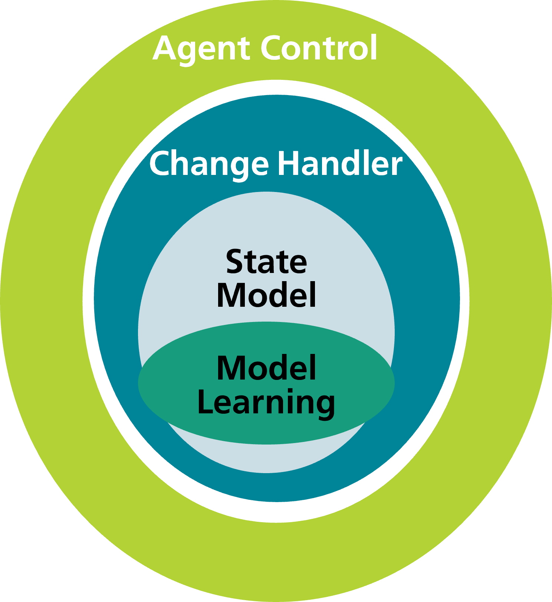

# Twin

    
    <h3>Agent Control and State Model</h3> 

In general, the twin folder contains the "state model" and the "agent_control" 
which are the centerpieces of the digital twin. 
Next to them, some useful supporting tools and extensions are provided. 
These are the "change_handler", the "model_learning" and the "repository_services".

   
    <h3>Schematic Structure Twin</h3> 

## State Model

The ***state_model*** contains the data model of the environment (production and logistics).
The idea is that each scenario has its own state model object. 
This means that no distinction is made between scenarios 
that reflect the physical world and virtually generated simulation scenarios. 
In both cases, changes from the environment are included in the state model in the same way 
(however, in some cases through passing the agents first).
Next to environment the planning services such as the factory planner or 
the scenario analytics are based on the state model.
While the "static" state model is the output of the factory planner, 
the state model serves as input for the scenario analytics. 
Concluding, the state model is connected to all areas of the digital twin framework.

## Change Handler

The ***change_handler*** serves as the interface layer of the state model.
Therefore, changes made by the agents (-control) or coming from the real world must pass the change handler.

## Agent Control

The ***agent_control*** contains the tools to change the state of the state model.
This is done by interaction of multiple agents (Multi Agent System).

## Model Learning

The ***model_learning*** provides tools for the learning of process models in a standardized way.
This supports the standardized and easy sample generation and the dataset creation.

## Repository Services

The ***repository_service*** is used to persist the state model.
In general, state models can be categorized into "static" and the "dynamic" ones 
(further details are available in the state_model folder).
In the modelling phase, a static state model is created while, e.g., for simulation runs a dynamic state model evolves.
For these different use cases, different persistence tools are provided.

## Notice
This work is licensed under the [CC-BY-4.0](https://creativecommons.org/licenses/by/4.0/legalcode).