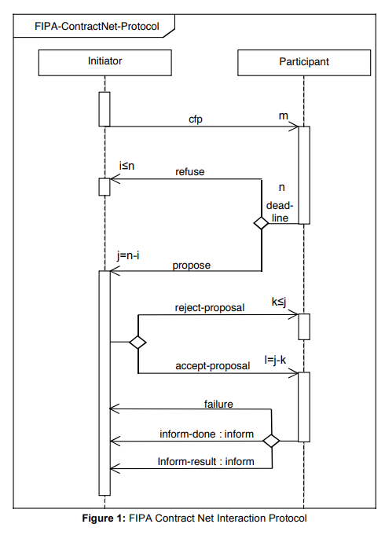

# Agent Control

The module agent_control is used for the simulation control of a use case, for example a shop floor.

Therefore, different components are used and can be fundamentally differentiated.
The general, the organization contains, the agents participating in the simulation and is responsible 
for the round management that ensures that the normal async behaviour of the agents is synchronous at the crucial points
in the simulations.  
The agents contain their partial information given in advance with instantiation, such as the digital twin, 
and updated within the simulation.
The planning and execution of actions is executed through the behaviours of the agents.
The behaviours remain in the agent, actually until the end of the simulation and call continuously their run method.
This means, if the run method is end, a further call is taken and executed 
(I think, if enough processing capacity is available). Accordingly, the most methods of a behaviour are called from 
the behaviour run method, but also parallel calls are possible through another behaviour for example through the agent 
(self.agent) itself.

| file         | classes                                                                                | 
|--------------|----------------------------------------------------------------------------------------|
| organization | The agent organization is included in each agent and is used for the round management. |
| agents       | The agents are differentiated into different agent types                               |
| behaviours   | The behaviours serves as mean for the execution of the agent goals                     |

The agent control is based on the spade library (that currently allow only the usage of python 3.10 
(State: 01.08.2023)), that allows the async behaviours and the communication through the Openfire xmpp server.

Spade documentation:
https://spade-mas.readthedocs.io/en/latest/ 

## organization

    The organization is especially used to for the round management. 
    Therefore, each agent has access to the organization object.
    If other tasks are needed to be executed centrally, the organization is as well usable for them.
    For example, for preliminary requests to avoid not promising requests.

# Definition of agents

Therefore, different agents are defined in the files on the first level:

| file       | classes                                                                            | 
|------------|------------------------------------------------------------------------------------|
| digitwin   | DigitalTwinAgent                                                                   |
| order      | OrderPoolDigitalTwinAgent, OrderDigitalTwinAgent                                   |
| resource   | ResourceDigitalTwinAgent, TransportAgent, WarehouseAgent, WorkStationAgent |

## basic

### | DigitalTwinAgent

> **Description:**  
    the agent provides ...
    - standard attributes like the digital twin, the change handler as interface to the digital twin 
    and the environment etc.
    - some standardization/ simplifications for the general communication procedure

## order

### | OrderPoolDigitalTwinAgent

> **Description:**  
    responsible to respond to new order requests by the order agents/ order release management

> **Behaviours:**  
    ***OrderRelease:***   
    - takes the requests from the order agents and return orders to process next  
    - therefore the behaviour is also responsible to release the orders in the right sequence

### | OrderDigitalTwinAgent

> **Description:**  
    responsible to organize the order completion

> **Behaviours:**  
     
    ***OrderManagement:***  
    
    the procedure is described in the left side of the figure  
     
    The order management is used to complete order an order.
    But before an order can be completed, the order must be requested from the order pool agent. 
    This is therefore the first step.  
    Afterward, the next to process value added processes (it could be more than one process - 
    but maybe the further implementations works 
    not in all cases with more than one process) are determined based on the priority chart.    
     
      
    Priority chart
      
    The determination rule should be set for each 
    project. Maybe a standard pool should be implemented in the future.  
    If the value_added_processes  are chosen, preconditions are derived. Preconditions are the main (part/ resource) 
    entity_type and the support entity_type which should be organized in advance in the organization.  
    The organization is also project dependent. For the currently implemented simulations two different approaches are 
    used. For the bicycle world, a simulation round contains three phases 
    (each is a round for the negotiation behaviours).
    In the first phase, the main entity_type and support entity_type is organized. 
    If it is organized, the phase is skipped for the further simulation rounds of the simulation.
    In the second phase, the value added processes are organized. Here, the max transport time is considered. 
    In the future, the time could be destination dependent.  
    If the value added process is successfully organized too, the transport is requested (third phase).  
    If all phases are successful, the process_executions are released, else the process_executions are thrown away.
    In both cases, the participating agents are informed.  
    Currently the organization phases are repeated until a solution is found, without stopping for execution. 
    To ensure the feasibility, the consideration period is extended.  
    For the Schmaus case, only one phase is needed. This is the case, because the shop floor has 
    a low degree of flexibility. 
    The main loading needs no access through a resource, to transport the box, etc., 
    the next value added process is fixed and 
    no flexibility in the next station possible to approachable/ accessible is available.
    The sequence is a little bit different. First, the support and main entity_type is organized, than the transport, 
    and only in the end, the value added process is organized.  
     
    ***InitiatorBehaviour:***  
    - described below for the resource agents  
     
    ***EnvInterfaceBehaviour:***  
    The env interface behaviour is used in the order agent to subscribe on process_execution progress information.
    Furthermore it declares to be ready for a new round, which means that the simulation can go on and execute 
    the planned executions. 

## resource

### | ResourceDigitalTwinAgent

> **Description:**  
    - the agent class is responsible for a resource and therefore to plan requests from the order agent  
    - an agent can be responsible for 1 to n resources  
> --------------------------------
>  Phases of one simulation round:  
>    1. planning of possible process_executions (executed by the PlanningBehaviours)  
>    2. coordination (executed by the coordinator/ scheduler)   
>    3. response to the order agent (managed over the negotiation behaviours)  
>    4. acceptance (managed through the negotiation behaviours)  
>    5. forwarding to the simulation environment (through the agent responsible for the main resource)
> --------------------------------

> **Behaviours:**  
> 
> --------------------------------
> > **PlanningBehaviours:**  
    
    the planning procedure is described in the top right  
     
    ***ProcessRequest:***  
    The process request is organized into two phases:  
    In the *resource organization* the resource demand is determined, requested from the resource provider agent and 
    subsequently combined to a process_execution_variant with the other resources found.  
    Afterward, in the *part organization*, missing parts are determined and also requested from the part providers.
    Accordingly, to the resource requests, the parts are added to the process_execution_variant.
     
    ***ProcessGroupRequest:***  
    The *process group organization* is needed when a sequence of processes/ process chain e.g. for transport is needed. 
    Hence, they should be ordered in the right sequence. Here also the path executability is checked, to avoid traffic. 
    Currently,  it could be called from the order agent to organize the transport 
    between value added process executor resources and the part request 
    that need to transport the parts also to the location of demand.
     
    ***ResourceRequest:***  
    The *resource organization* has as input an entity_type or an resource (if a resource for example 
    is married to the order and no other resource should be chosen, in this case also a resource binding to an order
    is considered). In the case of an entity_type all matching resources are determined and for each one 
    the availability in the respective accepted time period is checked (therefore planned process_executions 
    are considered too). For each resource a process execution path/ component is created.  
    If the resource is not available at the location of demand, access/ approach/ position connector processes 
    are specified and here the ability to execute the process, is also checked.
    For use case specific pro
> ---
> @Christian
> **NOTE:** For the future, transport accesses should be only considered in the scheduling itself, 
            because these connectors would be changed, when a resource has been scheduled for a process and 
            is scheduled in the same round for another process of another request.  ... 
            Maybe a heuristic value for the time needed for the approach would be a better alternative.
> ---
> > ***PartRequest:***  
    The *part organization* works similar to the resource request. Based on the requested entity type, parts are reserved for
    the simulation round (I think also for later if scheduled, until taken from the storage).  
    Currently only the parts from the warehouse are considered, because the reservation is only valid for the resource 
    (in this case "warehouse") itself. If a part is transported to another resource (e.g. a workstation), the parts are 
    not reserved anymore. Nevertheless, the parts are planned for another process.
    Afterwards a transport process is organized through a *process organization* request if the parts 
    are not at the location of demand.
     
> --------------------------------
>   ***ResourceBinding:***  
    To ensure that already binded/ linked/ married resources (to an order) are not proposed to other orders, the order 
    agent can bind resources with a bind message. The resource is already informed in the planning process 
    that the resource could be binded, if a complete proposal can be built.
> --------------------------------
> > **NegotiationBehaviours:**  
    The negotiation behaviour is based on the FIPA Contract Net Protocol 
    (http://www.fipa.org/specs/fipa00029/SC00029H.pdf), presented below. 
    Some extensions are made to allow further communication partners.
      
    FIPA CNET protocol
      
    On the basis of the CNET, two communication sides are used. The initiator and the participant and each of them has 
    his own behaviour. For the easier instantiation and communication among other, the CNET is used which is 
    no real behaviour.
     
    ***CNETNegotiationBehaviour:***  
    Used for instantiation of the CNET behaviour and for the communication of the two behaviours within the same agent.
     
    ***InitiatorBehaviour:***  
    The initiator is used to initiate call for proposals (e.g. Process (Organization) Request). 
    With accordance to the CNET, the acceptance and rejection of an proposal is done too.
    Furthermore, the proposals that are refused or proposed, are collected and send to the participant on the way back.
     
    ***ParticipantBehaviour:***  
    The participant is round progress dependent. Therefore, to the beginning it syncs with the other agents (round start).
    With the start of a round, it hears and collect call for proposals (cfp)/ requests (planning). 
    If a new cfp is available, the planning process is triggered. 
    If all call for proposals are available a second sync is done.  
    The agents that have open proposals, go into the end negotiation phase.
    In the end negotiation, the proposals that should be scheduled (resource and part) are forwarded to the coordinator 
    agent. Getting back the scheduled proposals/ components, the results are passed to the requesters, 
    until the first requester is reached.
    The first requester has the option to reject or accept the proposal received or to receive a rejection in response 
    which does not entail any possibility.
    The acceptance or rejection is afterward passed to the agents and the process_executions are passed 
    to the environment.
     
>
> --------------------------------
>   ***EnvInterfaceBehaviour:***  
    The env interface behaviour is used to forward the released process_executions to the environment/ simulation.
    Furthermore it declares to be ready for a new round, which means that the simulation can go on and execute 
    the planned executions. 
> 

### | TransportAgent

> **Description:**  
    responsible for resources that are used in the environment as transport resources

### | WarehouseAgent

> **Description:**  
    responsible for the warehouses and their stored entities (the most are actually parts)

### | WorkStationAgent
    
> **Description:**  
    responsible for the work stations and their buffers

## scheduling_coordinator

### | SchedulingCoordinatorAgent

> **Description:**  
    responsible for the central scheduling of partial schedules from the 'decentral' agents

>   ***SchedulingCoordinator:***  
    Receives the partial schedules from the resource agents and find a feasible schedule solution.
    In the end, the schedule is sent back to the resource agents.  

## change_handler

> **Description:**  
    Currently two different change handler exists. One that is responsible for a real production/ logistics environment 
    and another for the simulation. In both, the agents can subscribe on progress information of specified objects 
    such as process_executions.  
    The ChangeHandlerSimulation has as extension the sync function, that ensures the stop in planning phases, 
    where the agents can plan further process_executions or react on changes ...

## event_discrete_simulation

> **Description:**  
    The simulation stores the event in a simulation queue. The latest event considered first...
    Events from the same second are executed in the same round.
    If at least a complete execution is available (assuming that it is possible), the execution is passed to 
    the change handler, who forward the new objects to the subscribers.

# ToDo: Tree description in general (messages, proposal, process_execution_component, preference)