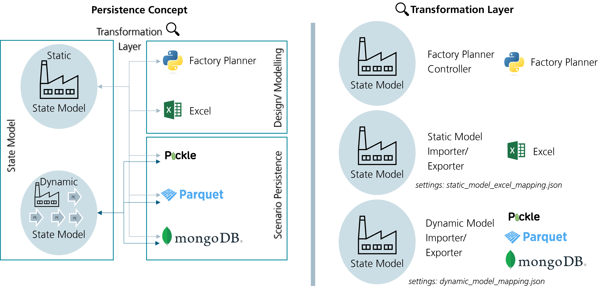

# Persistence

## State Model Persistence



In general, persistence is differentiated between static and dynamic state models.
Some reasons can be found for the differentiation:
 - Static models are mainly used in the modelling/ designing phase, which requires more interaction with the model. 
   Therefore, interaction with Excel files by the user is preferred.
 - Since the dynamic model arises with time considered (real world, simulation), the amount of data also enriches. 
 - In the usage phase, faster alternatives are preferred. 
   Since the interaction is stepped in the background, pickle files are preferred.

The high amount of cross-references in the state model makes it impossible to simply store the data in pickle files. 
A transformation/ serialization is required to transform the python objects into capsuled objects 
without direct links to other state model objects.

Static State Model (Excel) Mapper json file
```json
{
  "target_schema": "xlsx",                  - resulting file type
  "reference_type": "label",                - label means that the labels/ static model ids are used as reference
  "sources": [                              - parameters of the state model python object 
    {
      "source": "entity_types",             - a parameter of the state model python object
      "serialization_kind": "list",         - the type of the parameter value
      "serialize_unique": false,            - states if the object is unique or can have duplicates
      "classes": [                          - classes allowed in the parameter value
        "EntityType",
        "PartType"
      ],
      "drop": [                             - value parameters that are droped (e.g., "identification" is always 
        "identification"                       dropped and set again in the import)
      ]
    },
    ...
    ], 
  "sheets": [                               - sheets of e.g., the excel file
    {
      "name": "EntityType",                 - name of the excel file sheet
      "classes": [                          - classes inside the excel sheet
        "EntityType",
        "PartType"
      ],
      "columns": [                          - columns inside an excel sheet
        {
          "column_kind": "type",            - ToDo ???
          "description": "description",     - Describes the column/ parameter 
          "notation": "notation",           - States the notation of the parameter
          "example": "example",             - Gives a modelling example 
          "mandatory": "mandatory",         - States if the parameter is mandatory
          "name": "index",                  - Name of the parameter
          "format": "string"                - format of the parameter (ToDo: required in export?)
        },
	    ...
	    ],
	],
}
```

Dynamic State Model Mapper json file
```json
{
  "target_schema": "pkl",                   - resulting file type
  "reference_type": "identification",       - label means that the labels/ static model ids are used as reference
  "sources": [                              - parameters of the state model python object 
    {
      "source": "entity_types",             - a parameter of the state model python object
      "serialization_kind": "list",         - the type of the parameter value
      "serialize_unique": false,            - states if the object is unique or can have duplicates
      "classes": [                          - classes allowed in the parameter value
        "EntityType",
        "PartType"
      ],
	 {
		"source": "plant",
		"serialization_kind": "single_value",
		"serialize_unique": false,
		"classes": ["Plant"],
		 "drop": [                          - value parameters that are droped 
        "work_calendar"
      ]
	},
    ...
    ], 
}
```