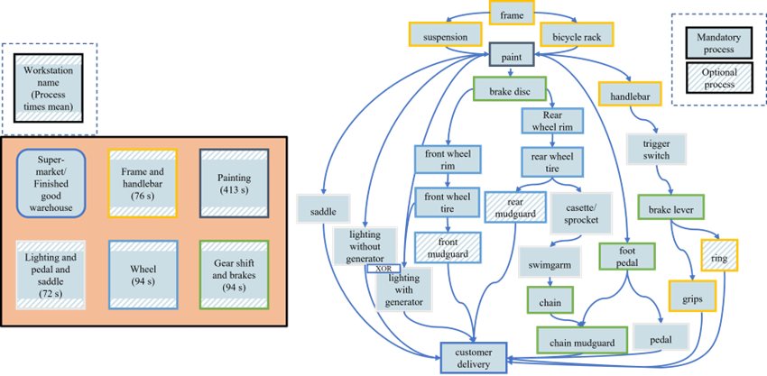

# Bicycle world

- # ToDo

## Bicycle world description

To show the relevance of integrated scheduling, a bicycle assembly reference model was designed and validated in a
continuous dialogue with an expert from the automotive sector. It provides the possibility to compare the integrated
part flow scheduling with the decoupled part flow scheduling in a simulation. The bicycle assembly contains five
workstations with a processing capacity of one bicycle at a time. The shop floor layout is presented in Figure 4 (a).
Almost all of them are standardized, meaning on each workstation several different assembly processes can be executed.
The only exception is the painting station, which can only perform the painting process. The painting station is
furthermore a bottleneck in the assembly priority graph as shown in Figure 4 (b), since no process can be executed
alternatively at this point of the priority graph. It is assumed that the painting process time is approximately five
times higher than the average of all assembly processes. The queue for main part AGVs waiting to enter a workstation is
not limited. Each workstation is equipped with a part buffer, where the low and high variant parts can be stored for a
short time. The capacity of the buffers for the parts is also not limited. The high variant parts are delivered by high
variant part AGVs that transport the parts from the supermarket to the workstations. In addition, the main part AGVs
transport the main products (the bicycle frame). Each AGV has a capacity of one part and the same speed. Acceleration (
e.g. in changes of direction or start-up) is not considered. It is ensured that two AGVs cannot load or unload at the
same station (supermarket or workstation buffer) at the same time but the AGVs can pass each other and other resources
to reach their destination, which means that potential traffic jams are not considered. The supermarket always stores
sufficient parts to meet the demand of the processes.

To represent multi-variant product orders, the products are randomly generated by choosing one feature from each of 11
feature clusters. Most features need one or more processes that must be executed, to create the product. On this basis,
an order can choose one of nine bicycle frames available, to which some of the 141 possible parts are added in 17 to 22
value-added processes resulting in approximately 600 million different product configurations. As seen on the priority
graph in Figure 4 (b), optional processes for example the ring or the mudguard assembly are included. Furthermore, the
lighting assembly process is available in two different constellations. The one with a generator has a second
predecessor and the other without did not need them. Additionally, the customer delivery process is performed from the
finished goods warehouse. The process design was developed to be as close as possible to a real bicycle production.
Moreover, care was taken to ensure a high degree of flexibility in using the potential of matrix production. The
processes that can be executed by the same workstation are presented in the same color in Figure 4 (b). For example, the
first process “frame assembly” (orange color) is performed by the same workstation than “handlebar assembly”. Each
process can only be performed by one workstation. As stated in (Schmidtke et al. 2023) the process times of the assembly
can be different in the matrix production. The process times for the part supply differ between 20 and 49 seconds for
one way between a workstation and the supermarket. Therefore, a complete part supply including accessing the supermarket
and loading the part takes on average about 60 seconds in a simulation run. In comparison the mean process time for a
value-added process executed on workstations is 98 seconds. In contrast to realistic behavior, all process times are
assumed to be deterministic. This is a limitation that does not affect the results because replanning is not considered.
To be close to reality, however, future research could also include stochastic behavior through normal distributed
process times often used in this context (Schmidtke et. al. 2023; Filz et al. 2019).