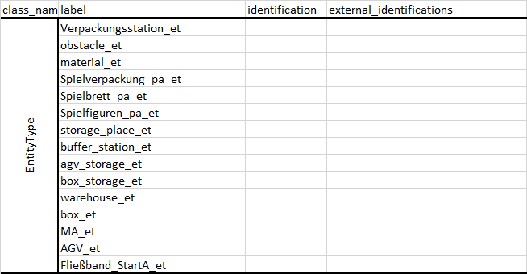

   <h1>How to model a static twin model with Excel (fast)? 🚀</h1>

## Introduction
The state model (twin model) describes a virtual "state" of the environment. 
The description contains immaterial objects (orders, processes, etc.) as well as material objects 
that have a physical counterpart (machines, etc.) on the shop floor.
To represent an environment as a virtual twin, a static model must be modeled in advance, 
Afterward, dynamic data from the shop floor can be integrated or simulations be executed and reach further states.
The static model can be created manually (excel, factory planner (GUI) coming soon) or learned (ML application).

The manual modeling of the static state model is complex 
and therefore requires a stringent modeling sequence in order to model correctly.
If you have not understood the state model, it is recommended to read the README related to the state model 
(twin/model/README.md). 
Here you will be familiarized with the existing classes, their use and relationships.

## General Semantics 

A step-by-step guide "How to model a static twin model with Excel?" is described below, 
but first a few general aspects of the Excel file semantics are explained.
Given this structure, the first row provides the class_name, the label and the attribute names 
("identification", "external_identifications", etc.).
For reasons of structured modeling, each Excel sheet contains only a few classes, in most cases only one.

- ***class_name***: digital twin class name (e.g., EntityType)
- ***label***: The label name is unique within the Excel file. 
  If the label is set in the attributes of an object (a row in the Excel file), 
  the object associated with the label is stored in the regarding object within the import process.
  E.g., a part (label: "gear_pa") is set in the attribute "situated_in" of a warehouse (label: "warehouse_w").  
  To know of which type an object/label is, all labels end with the short name of the class_name.
  E.g., the "EntityType" label "Verpackungsstation_et" ends up with "_et".
- ***identification***: the identification is a digital twin internal ID. If not set, 
  the identification is generated automatically in the import
- ***external_identifications***: here mappings to the physical world can be made
  (e.g., {"work_station1": ["ID xyz"], "sensor1": ["ID abc"]} 
  if the entity is named in the data_source "work_station1" as "ID xyz" and in data source "sensor1" as "ID abc")
- ***amount***: The amount attribute allows generating multiple objects (e.g., parts) with the same properties. 
  Particularly relevant for parts if you want to avoid modelling parts of the same type 
  and with the same properties several times (several lines).
  Note that all parts instantiated are, for example, stored in the resource defined in the attribute "situated_in". 
  If you want to store the part in different storages, you should model the part multiple times 
  setting different attributes/properties.

### Entry Conventions for "advanced" python objects

As the input is processed with standard libraries in the import, some conventions should be followed 
regarding the data-type of an attribute:
- list: ["Verpackungsstation_et", "Verpackungsstation_et"] (the '"' as well as the ' ' next to a '"' are important)
- dict: {"Verpackungsstation_et": 1, "Verpackungsstation1_et": 2} 
  (similar to the list, the '"' as well as the ' ' next to a key value pair is important)
- datetime_tuple: (2022, 6, 27, 12, 0) - (year, month, day, hour, minute, second) - leading zeros are not allowed

## Where to start?
It is recommended to start with the order (in the sales area).
Coming from the order: Think about what your product is?
Therefore, you should start to model the Order, the Customer, the FeatureCluster, the Features and the Part.
Within this modeling, also the EntityTypes should be set.

If you connect the digital twin to your internal IT systems, please note the following ReadME: @Adrian, link to the corresponding README

If you are using the digital twin for study purposes: In the Order tab, you can have the digital twin generate orders based on product class, start date, delivery planned date

Afterward, the main resources (warehouse, work station ...) can be set. 
This includes the setting of the 2D-Layout and the ProcessExecutionPlan.
Given the main resources, the processes are set, including the process models.
Eventually, all areas are combined and tested regarding consistency.
The modeling sequence can be summarized on the high level as follows:
1. Sales
2. Part
2. Resource
3. Time
3. Processes
4. Combination
---

The following nomenclature is used for standardization:

@Niklas: Kannst du bitte 'AssemblyStation' in 'WorkStation' umbennen ...
StationaryResource: sr

## Entity Type

**Classes:**
- ***EntityType:*** Entity types are required to categorize entities, e.g., all parts of the same type.
- ***PartType:*** An entity type that defines additionally part-specific properties such as dimensions.

**Attributes**
- ***super entity type (EntityType, EntityType):*** 
  For products that are delivered to the customer or resources that are clustered, 
  it is possible to define a super entity type. 
  Super entity types are the total group of entity_types belonging to the same super entity type.
  For example: The product is a board game consisting of game packaging, game board and game pieces. 
  The super entity type is material.

---------
## Sales

All required attributes of Sales:
FeatureCluster, feature, selection probability distribution, product class, feature cluster

**Classes:**
- ***Feature Cluster:*** Group of features.
  Depending on the order type, one feature of each feature cluster is chosen (product configurator) or
  zero to n features can be chosen (shopping basket).
- ***Features:*** describe the product requirements from the customer perspective. 
  In the processes, it is defined, which value_added_processes are needed to fulfill the feature requirements.

**Attributes:**
- ***product class (FeatureCluster, EntityType):*** defines the product created with the feature cluster
- ***selection probability distribution (Feature, ProbabilityDistribution):*** 
  Defines how probable a feature is chosen from the feature cluster.
  Note, for the product configurator only the relation within a feature cluster is important.
- ***feature cluster (Feature, FeatureCluster):*** relation from the feature to the feature cluster
- ***is not chosen option (Feature, bool):*** if True, no value added processes are connected 
  with the feature (this means that no work is associated with the feature)
- ***price (Feature, float):*** cumulated prices within of all order features provide the price of the product

### Orders
Orders can be generated for studies in the digital twin or come from the shop floor.

The following attributes are required for this: 
Order, product class, order date, delivery date planned, customer, features requested

**Classes:**
- ***Order:*** The order coming from the customer relates to a product. 
They can be marked with a number from 1 to n, e.g. "order{1}_o", ..., "order{n}_o"

**Attributes:**
- ***product class (Order, EntityType):*** type of the product
- ***order date (Order, datetime_tuple):*** Format: "(year, month, day, hour, minute)".
Note leading zeros are not accepted.
- ***delivery date planned (Order, datetime_tuple):*** Format: "(year, month, day, hour, minute)".
Note leading zeros are not accepted.
- ***customer (Order, Customer):*** End consumer
- ***features requested (Order, ToDo):*** Horizontal listing of all available features (column header): 
  - 1 (or more than one depending on the order type) = feature chosen; 
  - 0 = no feature chosen (ToDo)

---------

## Part

**Classes:**
- ***Part:*** a product or a part that is consumed by the product

All required attributes of part:
Parts, name, entity type, situated in, quality

**Attributes:**
- ***entity_type (Part, EntityType):*** defines the product created with the feature cluster
- ***quality (Part, float):*** between 0 and 1 - zero stands for poor quality and 1 for excellent quality
- ***situated_in (Part, Resource):*** the resource, the part lies in
- ***part_of (Part, Part):*** the part, of which the part is the part of
- ***parts (Part, Part_list):*** a list of subparts and ingredients
- ***part_removable (Part, bool_list):*** complementary list to the parts, which states if the part is removable or not

The parts are all elements of the deliverable product and their entity type, warehouse location and 
quality for one product.

---------

### Plant

**Classes:**
- ***Plant***: Defines the layout of the plant with their dimensions.

**Attributes:**
- ***corners (Part, list_of_coordinate_tuples):*** 
  The dimensions of the plant are described by the corner points of the building.
  The coordinates are specified as a list of tuples (x and y), with negative values placed in brackets if used.

> Note: The dimensions are uniform throughout the entire state model. 
> This also applies to the positioning of resources, conveyor belt, etc. 

---------

## Resource

Resources are subdivided into stationary and non-stationary resources.

------------------------
## Stationary Resource

All required attributes of the stationary resource:
label, name, entity type, plant, position, length, width and quality

**Attributes:**
- ***efficiency (StationaryResource, ProbabilityDistribution):*** modulated by a distribution. 
  The efficiency can be changed during change of the distribution parameters.
  Available distributions are: SingleValue, Normal

### Conveyor Belt

All required attributes of the conveyer belt:
label, name, entity type,process execution plan, plant, cost per second, position, length, width, efficiency, quality,
allowed entity types, capacity per entity type, entity on transport, conveyor length, pitch, capacity

**Attributes:**
- ***allowed entity type:*** modeled as string based list of possible entity types
- ***entities on transport:*** modeled as string based list of entities

### Storage

All required attributes of the Storage: 
label, name, entity type, process execution plan, plant, costs per second, position, length, width, efficiency, 
situated in, quality, capacity, stored entities

**Classes:**
- ***Storage:*** The storage contains entities of the same entity type. 
  These can be resources (situated in e.g., Loading Station) or parts (situated in e.g., a Warehouse, WorkStation, AGV).

### Warehouse

All required attributes of the warehouse: 
label, name, entity type, process execution plan, plant, costs per second, position, lenght, width, efficiency, quality, 
storage_places

**Attributes:**
- ***efficiency:*** modulated by a distribution. 
  The efficiency can be changed during change of the distribution parameters.
  Available distributions are: SingleValue, Normal
- ***storage place:*** describes the load carrier or materials and their storage places. It is mapped as a dictionary
- ***storage place:*** KeyValue: load carrier or materials, value: string based storage place

### Work Station

All required attributes of the work station: 
label, name, entity type, process execution plan, plant, position, length, width, efficiency, quality, buffer stations

**Attributes:**
- ***efficiency:*** modulated by a distribution. 
  The efficiency can be changed during change of the distribution parameters.
  Available distributions are: SingleValue, Normal
- buffer stations: describes the load carrier, materials or resources and their storage places. It is mapped as a dictionary
- buffer stations: KeyValue: load carrier, materials or resources, value: string based storage place

------------------------
## Non-stationary resource

Modeled in the sub resources.

### Active moving resource

All required attributes of the active moving resource:
label, name, entity type, process execution plan, plant, costs per second, position, length, width, situated in, 
quality, orientation, storage places, speed, energy label, energy consumption, energy capacity

- storage places: KeyValue: entity type, value: string based list of the corresponding storages
- speed, energy label, energy consumption, energy capacity: default value of 1 

### Passive moving resources

All required attributes of the passive moving resources:
label, name, entity type, process execution plan, plant, costs per second, position, length, width, situated in, 
quality, storage places

- storage places: KeyValue: entity type, value: string based list of the corresponding storages.

------------------------
## Time

All required attributes of the time:
ProcessExecutionPlan, ProcessExecutionPlanConveyorBelt, start_time

**Classes:**
- ***ProcessExecutionPlan:*** Process Execution plan for each non conveyor belt resource of the production 
  and logistics system. The plan does not take into account parallel execution of processes. 
  If the same plan is used by different resources, it can be described, 
  for example, that a workstation and its buffers cannot work in parallel.
  This is due to the modeling freedom of the modeler.
- ***ProcessExecutionPlanConveyorBelt:*** Process Execution plan for each conveyor belt

------------------------

## Process

All required attributes of the process:
Value added process, process, name, lead_time_controller, transition controller, quality controller, 
transformation controller, resource controller,
group, feature, predecessors, successors

- ***predecessors:*** List of all VAP predecessors of the VAP @Adrian
- ***successors:*** List of all VAP successors of the VAP @Adrian

### Process controller

Mapping of the process models to the process controllers.

All required attributes of the process controller:
Resource controller, process time controller, transition time controller, transformation controller, 
quality controller, resource model, process time model, transition model, transformation model, quality model

### Process Time Model

All required attributes of the process time model:
SimpleSingleValueDistributedProcessTimeModel, SimpleNormalDistributedProcessTimeModel

**Classes:**
- ***SimpleSingleValueDistributedProcessTimeModel:*** single value is needed
- ***SimpleNormalDistributedProcessTimeModel:*** mue and sigma are needed to map the distribution

### Resource Model

All required attributes of the resource model:
Resource group, resource model, resource groups, resources, main resources,

**Attributes:**
- ***resources:*** String based list of active includes resources. Main resources must be element 0
- ***main resources:*** string based list of the main resource

### Quality Model

All required attributes of the quality model:
SimpleBernoulliDistributedQualityModel, probability

- Modeling without quality distribution: no_issue_qm and probability 1

### Transition Model

All required attributes of the transition model:
Transition model, possible origins, possible destinations

**Attributes:**
- ***possible origins:*** string based list of the origins. Zero to n origins possible.
- ***possible destinations:*** string based list of the destination. Zero to n destinations possible.

### Transformation Model

All required attributes of the transformation model:
EntityTransformationNode, TransformationModel, rood nodes, parents, children, entity type, amount, quality, 
transformation type, io-behavior

**Classes:**
- ***EntityTransformationNode:*** Contains parents and children nodes, entity type, amount, quality, transformation type 
  and io-behavior.
- ***TransformationModel:*** Contains the root nodes, which is a list of EntityTransformationNode.

**Attributes:**
- **transformation type:** only the following transformation types are allowed:
  -MAIN_ENTITY, BLANK, SUB_PART, INGREDIENT, DISASSEMBLE, SUPPORT, UNSUPPORT
- **io-behavior:**
  - CREATED, EXIST, DESTROYED

In the modeling process, a distinction is made between several types of EntityTransformationNode.
The detailed explanation can be found in the following ReadME: (twin/model/README.md)
