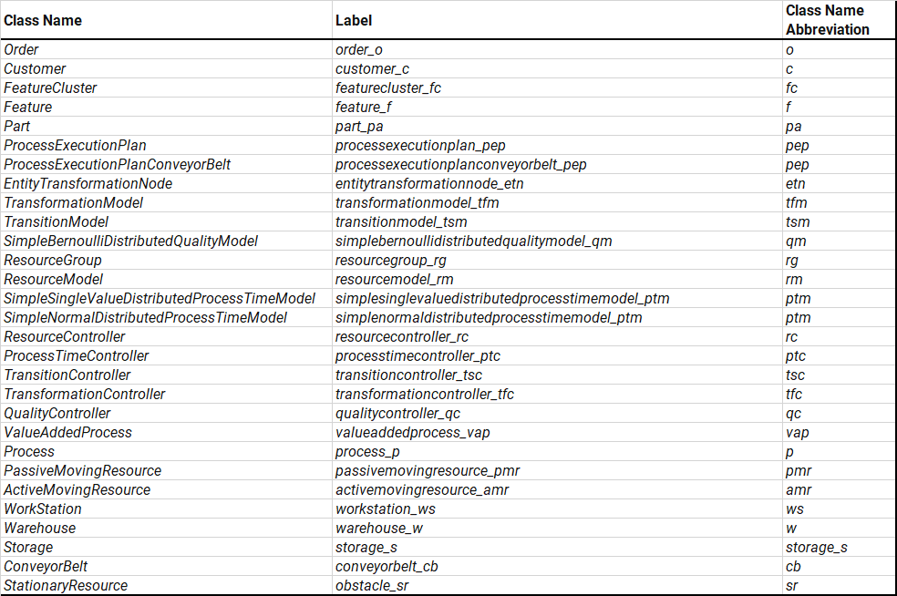
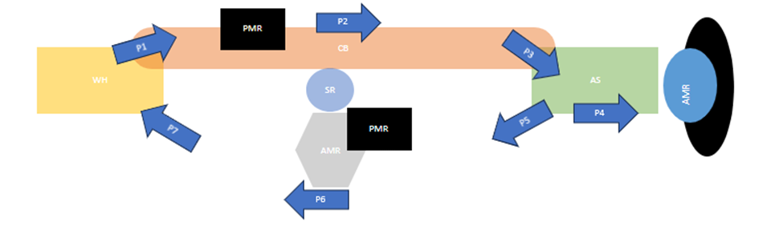

# Open Factory Twin (OFacT) — Modeling Handbook for the Digital Twin State Model

***

## Table of Contents

- [Introduction](#Introduction)
- [Basics of Excel modeling](#Basics-of-Excel-modeling)
- [Where should you start?](#Where-should-you-start?)
- [Introduction to the Board Game World](#introduction-to-the-board-game-world)
- [Sales](#sales)
    - [Orders](#orders)
    - [Part](#part)
- [Explanation of the Board Game Factory](#explanation-of-the-board-game-factory)
- [Plant](#plant)
- [EntityType](#entitytype)
- [Introduction to the Board Game World](#Introduction-to-the-Board-Game-World)
- [Sales](#Sales)
    - [Orders](#Orders)
    - [Part](#Part)
- [Explanation of the Board Game Factory](#Explanation-of-the-Board-Game-Factory)
- [Plant](#Plant)
- [EntityType](#EntityType)
- [Entity](#Entity)
- [Resource](#Resource)
    - [Stationary resource](#Stationary-resource)
    - [Storage](#Storage)
    - [Conveyor belt](#Conveyor-belt)
    - [Workstation](#Workstation)
    - [Non-stationary resource](#Non-stationary-resource)
    - [Passive movable resource](#Passive-movable-resource)
    - [Active moving resource](#Active-moving-resource)
- [Time](#Time)
    - [Process execution plan](#Process-execution-plan)
    - [Conveyor belt process execution plan](#Conveyor-belt-process-execution-plan)
- [Process](#Process)
- [Value Added Process](#Value-Added-Process)
    - [Resource model](#Resource-model)
    - [Transformation model](#Transformation-model)
    - [Quality model](#Quality-model)
    - [Process Time Model](#Process-Time-Model)
- [Process Control](#Process-Control)
- [Distributions](#Distributions)

***

## Introduction

Before you start, we recommend that you read the ([State Model README](../../../../ofact/twin/state_model/README.md)) to
understand the respective classes and relationships of the static model as well as the respective explanations of the
elements in the static model.

In this modeling handbook, you will get to know the basic contents of modeling and apply them hands-on.
We will take the example of a board game factory and try to model it.
The step-by-step instructions will guide you through your first modeling using a small example.
You will model your first system section (template) in order to be able to apply the understanding
you have gained to a larger example (Bicycle World).
With the help of the Bicycle World, you will get to know further applications of OFacT and
test them along further practice-relevant questions.

## Basics of Excel modeling

But before we start, some basics for the general semantics in Excel modeling should be introduced.

The modeling Excel file contains more than one sheet and each sheet typically contains one state model class.
If some classes are very similar, two or more classes can also be contained in one sheet.
In each sheet, however, you can model specific objects with parameter sets that are based on the specified state model
classes. In general, each sheet has the same semantics.

The first column contains the name(s) of the state model class(es) (e.g. EntityType, Process), and the second column
contains the object names for modeling (each name must be unique).
The other columns are used for the class parameters/attributes.
If the label is set in the attributes of an object (a row in the Excel file),
the object associated with the label is stored in the respective object within the import process
(e.g. a part (label: "gear_pa") is set in the attribute "situated_in" of a warehouse (label: "warehouse_w")).
In order to know the type of an object/label, all labels end with the short name of the class_name
(e.g. the "EntityType" label "packaging_station_et" ends with "_et").
Some basic attributes of the state model objects are explained below:

| Column name              | Description                                                                                                                                                                                                                                                                                                                                                                                                                                                                                                                                                                               |
|--------------------------|-------------------------------------------------------------------------------------------------------------------------------------------------------------------------------------------------------------------------------------------------------------------------------------------------------------------------------------------------------------------------------------------------------------------------------------------------------------------------------------------------------------------------------------------------------------------------------------------|
| class_name               | digital twin class name (e.g., EntityType)                                                                                                                                                                                                                                                                                                                                                                                                                                                                                                                                                
| label                    | The label name is unique within the Excel file. If the label is set in the attributes of an object (a row in the Excel file), the object associated with the label is stored in the regarding object within the import process. E.g., a part (label: "gear_pa") is set in the attribute "situated_in" of a warehouse (label: "warehouse_w").   To know of which type an object/label is, all labels end with the short name of the class_name. E.g., the "EntityType" label "Verpackungsstation_et" ends up with "_et".                                                                   | 
| identification           | The identification is an internal ID of the digital twin. If not specified, the label is generated automatically during import                                                                                                                                                                                                                                                                                                                                                                                                                                                            |
| external_identifications | assignments to the physical world can be made here (e.g. {"work_station1": ["ID xyz"], "sensor1": ["ID abc"]} if the entity is designated as "ID xyz" in the data source "work_station1" and as "ID abc" in the data source "sensor1")                                                                                                                                                                                                                                                                                                                                                    |
| Amount                   | The amount attribute can be used to create multiple objects (e.g. parts) with the same properties. Particularly relevant for parts if you want to avoid modeling parts of the same type and with the same properties several times (several lines). It should be noted that all instantiated parts are stored in the resource defined in the "situated_in" attribute, for example. If you want to store the part in different warehouses, you should model the part several times Setting various attributes/properties. Each row (after the column headings) represents a single object. |

As the input is processed with standard libraries in the import, some conventions regarding the data type of an
attribute should be observed:

| Type           | Handling description                                                                                                                                                                    |
|----------------|-----------------------------------------------------------------------------------------------------------------------------------------------------------------------------------------|
| List           | ["Packaging_station_et", "Packaging_station_et"] (the '"' and the '' next to a '"' are important)                                                                                       |
| list_of_tuples | [("packing_station_et", "packing_station_et", ), ("Packaging_station_et", "Packaging_station_et", )] (the '"' and the ''' next to a '"' are important)                                  |
| dict           | {"Packaging_station_et": 1, "Packaging_station1_et": 2} (similar to the list, both the '"' and the ' ' next to a key-value pair are important)                                          |
| datetime_tuple | (2022, 6, 27, 12, 0) - (year, month, day, hour, minute, second) - leading zeros are not allowed                                                                                         |
| class_str      | NormalDistribution(1) quick instantiation option for classes with fewer input parameters and no real meaning in terms of content (e.g. probability distributions with input parameters) |
| enum           | EntityTransformationNode.TransformationTypes.MAIN_ENTITY (enum class or path and enum value/name)                                                                                       |

### Where should you start?

In the modeling, it is recommended to start with the order (in the sales area).
From the order: Think about what your product is?
You should therefore start by modeling the order, the customer, the feature cluster, the features and the part.
The entity types should also be defined within this modeling.
If you use the state model of the digital twin for simulation study purposes:
On the Order tab, you can have the digital twin generate orders based on
product class, start date and planned delivery date.
The main resources (warehouse, workstation ...) can then be set.
This includes setting the 2D layout and the ProcessExecutionPlan.
Based on the main resources, the processes including the process models are defined.
Finally, all areas are merged and checked for consistency.

The *modeling process* can be summarized at a high level as follows:

1. Sales
2. Part
3. Resource
3. Time
4. Processes
6. Combination

---

The following nomenclature is used for standardization:

## Introduction to the Board Game World

To explain the OFacT, we will look at a board game production in which a classic board game is "assembled".
This board game consists of a game board and game pieces, both of which are placed in (game) packaging.
Finally, the packaging is sent to the customer with the corresponding game contents.
On this basis, we have to think about how we model our customer orders.
Customer orders describe in the digital twin which product is to be manufactured.
For our example, this is the game packaging with contents.
As we model our products from a business perspective (from the customer's point of view), we use features for this
purpose. Ultimately, our product should be defined by the characteristics. Later, we will convert these characteristics
into processes to be carried out, but we are not there yet. The characteristics are described in the sales area.

## Sales

All available/possible features of the products are modeled in the sales area.
**FeatureCluster**s and **Feature**s are introduced for this purpose.
In terms of handling, modeling differs depending on the ***type of order***.
We distinguish between the "product configurator" and the "shopping basket".
With reference to our example, we could configure our individual game.

However, we could also assume that our game itself is a standardized product and that we also have other games on offer.
Finally, the customer can then select games from the range and combine them in a shopping cart.
The customer may, for example, buy several Monopoly games because he wants to give each of his students the same gift.
The decision as to whether the order type corresponds to a product configurator or a shopping cart depends on
whether an individual product is to be created in the end or
whether several "products" are to be combined into a collective product.
Depending on the type of order, either one (product configurator) or
0 to n features (shopping cart) can be selected from each feature group.
The features describe the product requirement from the customer's point of view.

If we take the example of the individual product, feature clusters are defined first.
Feature clusters describe different selection options.
For example, a feature cluster would be the game figures that can be selected in the "Sponge Bob"
or "Donald Duck" edition.
Each feature refers to a feature cluster (attribute: feature_cluster).
As only one product, the board game without any individualization is sold in the small example of the board game
factory, only one feature cluster is defined.
The defined feature cluster is called Brettspiel_fc.

However, there are two product requirements (features) for the board game:

1. The game must first be packaged (Pack_f) and
2. then delivered accordingly (Deliver_f).

Here, it is conceivable that the delivery could be carried out, for example,
by internal transportation to the corresponding collection point,
so that a further feature can be selected as an alternative.
With the "feature_cluster" attribute, the features are assigned to the respective feature cluster.
In this example, there is only one feature cluster (Brettspiel_fc).
As a result, the feature cluster was assigned to the features.
The attribute is only modeled for features.

Let's take a closer look at the feature clusters. As more than one product could be manufactured in the factory, it is
necessary to identify which feature clusters are required to manufacture a product.
For this purpose, a "product_class" is assigned to each feature cluster.
The "product_class" attribute is only required for feature clusters.
All feature clusters of a product_class belong to one product.
This assigns the feature cluster to the producing entity (product) type.
In the board game factory, the product of the entity type "Spieleverpackung_pa_et" will be delivered, which is why this
reflects the product_class.
Finally, it requires the modeling of the "selection_probability_distribution" attribute.
This attribute determines how likely it is that a feature will be selected from the feature cluster.
The probability is modeled as a distribution.
It should be noted that only the probability/relative proportion within a feature cluster is taken into account for the
product configurator.
It is therefore possible that the features are not always taken into account.
As the two features are mandatory for the execution of an order,
the modeling looks as follows: SingleValueDistribution(1).
Further distributions, including descriptions, can be found in the last section.

### Orders

The **order**s can either be modeled by the Excel modeling (manually) or generated automatically
(relevant for test purposes and simulation studies).
If you want to model the orders yourself, you can take the necessary attributes with the corresponding nomenclature
from Excel.
However, all **customer**s should be listed first.
To do this, you must first switch to the "Customer" class/sheet in order to list the respective customers.
The orders can then be modeled.

At the beginning, it is important to mark the respective *product_class* of the order.
In this handbook, there is only one deliverable product, so this attribute is identical for every order.
In addition, the *features_requested* attribute must be modeled in order to assign the required features to an order.
At the same time, each order has an order time (*order_date*) and a planned delivery time (*delivery_date_planned*).
The modeling must be based on the following scheme: (year, month, day, hour, minute)
The release_date of an order and the delivery_date_actual can be set by the controller.

### Part

Before we move on to our physical factory, let's briefly outline the **part**s.
We have noted that our product is the game box, which contains a game board and game pieces.
Based on this example, we have three parts, which are subdivided into product and (sub)parts, but ultimately product
and (sub)parts are not differentiated in our model:

- Game packaging
- Game board
- Game pieces

The necessary attributes, with the corresponding nomenclature, can be taken from Excel.
The *entity_type* attribute maps the entity/part type in the "Part" class.
*Situated_in* describes the storage location where the respective part is currently stored.
When modeling the parts, it must be noted that parts with more than one storage location must be modeled individually.
The necessary attributes can be taken from the Excel file.
For example, a screw can be stored as a part in two different storage bins.
In this case, the screw must be listed twice.
It is important to note that the parts do not have identical names.
For reuse, it is advisable to either number the
parts consecutively or to include the storage location.
Please note that it is recommended to select only one
alternative and then use it consistently.

Justification:
By storing the game board in two different storage locations, the game board must be modeled twice.
The label should be numbered consecutively based on the previous nomenclature.
The storage location of the respective label must also be added.
Please note the respective nomenclature of the storage.

## Explanation of the Board Game Factory

Now that we have looked at the sales perspective and have already discussed the parts/products, let's move on to
physical production.
This example shows a game factory.
The board game factory is sketched below as a simplified 2D layout.
To pack the games, the individual parts are taken from the warehouse (WH) and placed in boxes (PMR) on the conveyor
belt (CB) (P1).
The box with the contents is moved to the Assembly Station (AS) (P2) and then transferred to the Assembly Station (P3).
As soon as the materials are in the assembly station and the worker (AMR) is available, assembly
can take place in process 4 (P4).
The finished game is then loaded back into a box on an AGV (AMR) (P5) and then
returned to the warehouse (P6) and stored (P7).

| Abbreviation         | 	Description                        |
|----------------------|-------------------------------------|
| WH                   | 	Warehouse                          |
| P  {1, 2, 3, ..., 7} | 	Process {1, 2, 3, ..., 7}          |
| CB                   | 	Conveyor belt                      |
| AS                   | 	Workstation                        |
| AMR                  | 	ActiveMovingResource (AGV, Worker) |
| PMR                  | 	PassiveMovingResource (Box)        |
| SR                   | 	StationaryResource (Obstacle)      |

## Plant

Before we model the resources and processes of the factory, our factory needs a floor plan/layout.
The layout is modeled in the **Plant** object.
Resources created may only be mapped within the floor layout and also reference the plant in which they are located.
The area of the layout is defined by the definition of the (layout) corner points.
As mentioned in the description in Excel, a list of "tuples" is used to model the X and Y coordinates.
A "tuple" contains one X and one Y coordinate.

## EntityType

Before we get into the entities of the factory, we need to introduce the **EntityType**s.
They offer the possibility to "describe" entities.
For example, if we say that we want a Spongebob Edition Monopoly, we don't care which Spongebob Edition Monopoly we get.
It is actually enough for us that we get a game of the type "Spongebob Edition Monopoly".
In this case, this would be the same as the item number.
The same applies to resources:
if we think of a milling machine that has the same properties as another milling machine,
we can categorize it using a type.
This allows us to say, for example, that we need the resource of the milling machine type to carry out a process,
without listing every milling machine.

In addition to a *name*, entity types also have the *super_entity_type* attribute.
This attribute is not mandatory, but can be used to group types.
For example, yellow, red and blue game pieces can be grouped together under general game pieces.
This would then be the super_entity_type of the three entity types, but also an entity type itself.

*When should we use the super_entity_type?*
They become particularly interesting when they take out more complexity than they bring in.
This is the case, for example, if we want to describe that in the packaging process, game pieces of any
color were included in the game packaging.
(It can be assumed that the characteristics of the order ensure
that the customer's desired color has already been determined as input for the process).
In the modeling, we have limited the number of hierarchy levels to a maximum of 2.
**PartType**s make it possible to additionally model information relevant to parts in particular.
These relate to their spatial extent.

## Entity

We have already become familiar with some **Entities** in the product description and the board game factory described
above.
Now, we want to take a closer look.
Entities form the basic structure of the state model (of the digital twin) and are divided into parts and resources.
They describe the physical elements of the system section.
The following decision tree can help to categorize the respective physical elements,
with which each physical element can be assigned to a specific entity class.

The system section of the board game factory was highlighted in advance.
The following physical elements are present within the game factory,
which can be categorized into different entity classes:

| Element in the system	 | Entity class          |
|------------------------|-----------------------|
| Packaging station	     | 	Workplace            |
| Game packaging	        | 	Part                 |
| Game board		           | Part                  |
| Game pieces		          | Part                  |
| Warehouse_location	    | 	Storage              |
| Buffer_station		       | Storage               |
| Agv_Storage		          | Storage               |
| Box_Storage		          | Storage               |
| Warehouse		            | Warehouse             |
| Box		                  | PassiveMovingResource |
| Worker		               | ActiveMovingResource  |
| AGV		                  | ActiveMovingResource  |
| Assembly_line_StartA	  | ConveyorBelt          |

To ensure the desired behavior, the objects are parameterized in the modeling by setting the attributes.
As some attributes occur in several child classes, they should also be explained here for their children. 
Each entity must have a type (*entity_type*).
The entity type determines which type the entity is an instance of (but the instance comes from the entity).
For example, the milling machine XYZ can have the type milling machine.
This allows us to define later in the processes which resource may execute which process.
To distinguish the entities, they must also be given a *name*.
The *situated_in* attribute can be used to describe where the entity is currently located.
For example, it can be used to describe that a part is currently in storage or
that an employee/worker is in (or at) the workstation.
It is important that situated_in is either filled with an entity or actually not filled.
In addition, each entity has a *quality* that can be modeled.
The quality describes the state of an entity
and can affect the quality of other entities in process executions on the one hand
and can also be used as a requirement for a process execution on the other.

## Resource

The **Resource**s were extracted in advance using the decision tree. 
It is now important to model the corresponding resources within the classes. 
First of all, each resource should have a reference to the corresponding plant (attribute: plant). 
Furthermore, each resource receives a *process_execution_plan* for planning the resource. 
If the resource shares the plan with other resources, this is taken into account by the simulation 
so that only one of the resources involved is scheduled at the same time (particularly relevant for storages). 
A parallel plan in a ProcessExecutionPlan has not yet been implemented.
Every resource has a *physical_body*. 
Although this also applies to parts, the physical extensions are not modeled for these entities. 
The **PhysicalBody** can be modeled using the attributes *position*, *length* and *width*. 
The position describes the spatial center of the resources based on the X and Y coordinates. 
Although these coordinates can be freely selected, they should be based on the real system. 
The only important thing here is that the coordinates are located within the modeled factory (class: "Plant"). 
While the length and width of a resource do not change, the position of non-stationary resources can change.
The position/spatial extent is important for route planning, if relevant in the use case, and also for distinguishing
between transport and transfer processes. 
But this is discussed further in the processes.

## StationaryResource

**StationaryResource**s are irrelevant in the current version of OFacT. 
They should have no influence on the logical material flow or control. 
However, they can be included as obstacles for route planning purposes.
Examples are gates between production halls, columns, beams or similar obstacles.
Each stationary resource has an *efficiency* (distribution). 
The available distributions and explanations can be found in the priority chapter. 
In this example, there is a normal distribution with a mean value (µ) and sigma (σ) of 1. 
The modeling form is described as NormalDistribution(1, 1).

## Storage

Now that we've got to know some basic building blocks, let's get back to our board game factory. 
First, we want to build the Warehouse. 
Before we do this, we need to get to know a core element of the warehouses from which the warehouse is "assembled". 
These are the **Storage**s that can store entities, but only entities of the same entity type. 
E.g., resources, such as AGVs, or parts, e.g., material, which are stored in a warehouse, 
at a workstation or other resource. 
These are listed in *stored_entities*. 
To ensure that only entities of one type are stored, the type can be specified with the *allowed_entity_type* attribute.
Furthermore, the maximum capacity can be limited with the *capacity*.
Based on the storages, the warehouse forms a grouping of storages. While the storages can only store one type of
entity (the same entity type), several types can be stored in the warehouse. For this purpose, the storage_places
attribute is introduced, which combines several storages in a dict. The key is the entity type to be stored in each case, 
and the corresponding storages that can store the entity type are appended as a list in the value.

## ConveyorBelt

The **ConveyorBelt** class is one of the stationary resources. 
This class is relevant in our example, as a continuous conveyor moves boxes from the warehouse to an assembly station 
in the form of a conveyor belt within the system section.
When modeling an assembly line, we should first consider from which *origin* to which *destination* 
our assembly line should flow. 
Both parameters are filled by storages. 
This also allows us to map congestion. 
Because if the destination storage is filled, no more units can be placed from the assembly line into the destination. 
The *flow_direction* of the conveyor belt should also be modeled. 
Flow direction 1 means that the conveyor belt moves entities from the origin to the destination, 
while -1 moves entities from the destination to the origin. 
In this way, for example, the flow direction can also be changed in the simulation, 
even if 1 should be taken as the default value in the static modeling s oll.
In the board game factory, the X and Y coordinates are (50, 52). 
It must be noted that the length and width are based on the position. 
To do this, both values must be divided by 2 (length, 4) and (width, 50). 
The calculation (value/2) results in a real length of 8 and a width of 100.
Furthermore, the length of the conveyor belt is used to calculate the throughput times. 
This is necessary to compensate for abstractions of the model in order to ensure a higher degree of realism. 
Possible multi-level structures (conveyor belts on several building levels) or conveyor belt geometries that deviate from
rectangles are abstracted in this way. 
The conveyor belt *length* in the example is 100, which is because there are no multiple levels or curvature.
Therefore, the conveyor length is identical to the modeled width (in this example, the length would not be identical
to the conveyor length). 
The calculation of the real width or length must be taken into account.
At the same time, the minimum distance between two entities (*pitch*) moving along the conveyor belt is required. 
In this example, this is 100, which means that only one entity can run on the conveyor belt, 
as another entity cannot maintain the minimum distance. The *capacity* of the conveyor belt is 1.
In addition to the layout and technical details, the respective entities that may be moved on the conveyor belt 
(*allowed_entity_type*s) and the capacity of the entities 
that may be moved on the conveyor belt (*capacity_per_entity_type*) must also be modeled.
In the board game factory, only boxes are transported on the conveyor belt, which is why the
allowed_entity_types must be modeled as follows: ["box_et"]. 
The capacities are listed as a dictionary. 
The entity types act as keys and their capacities as integers. 
The *entities_on_transport* attribute is a dynamic attribute and changes within the application. 
The attribute describes which entities are currently on the conveyor belt. 
In the initial situation, the conveyor belt is empty, which is why it can be left empty.

## WorkStation

After the individual parts of the game have been moved along the conveyor belt, we need a workstation at which the parts
are packed/assembled. 
The workstation is similar to the warehouse, but has *buffer_stations* instead of storage_places. 
Apart from this attribute difference, they only differ in their use.

## NonStationaryResource

What we are still missing are the mobile resources that we need in our example for the box, the employee and the AGV.
**NonStationaryResource**s are movable resources. 
These are modeled in the form of active and passive moving resources.
**ActiveMovingResources** are resources that we can move independently. 
These can be employees or means of transportation such as forklift trucks or AGVs. 
**PassiveMovingResource**s are moved with the help of a resource. 
These can be load carriers such as boxes or pallets.
Like the Warehouse, non-stationary resources also have *storage_places*. 
This enables them to store parts. 
From our example, the employee/worker or the box can hold parts.
We also use the *orientation* (only used for route planning), to define the orientation of the resource (rotation).
Specifically, an angle of -180 to 180 is specified. 
Route planning makes it possible to take into account industrial trucks 
or employees who move freely in production and may cause a traffic jam, which corresponds to waiting time. 
Route planning will be discussed in detail in a later release.

## PassiveMovingResource

For example, we would model the box with the **PassiveMovingResource**. 
Then there is only the *service_life*, which should reflect the service life of the resource. 
However, this is not mandatory.
The following example, which has already been described in the storage section, can be modeled in more detail.

## ActiveMovingResource

To model the employee/worker, we choose the **ActiveMovingResource**. 
Here we can set the *speed* in addition to the NonStationaryResource parameters. 
The speed describes how fast the employee can cover a distance of one meter (if the modeling unit of the layout is in
meters), but also how fast an employee can complete another task. 
The default value is 1. 
Attributes for the energy supply have also been included. 
*energy_label*, *energy_consumption* and *energy_capacity* are not taken into account in the current OFacT analysis.
This should allow all entities to be modeled. 
For the scheduling of resources, we need to have a look to the process execution plans.

## Time

The **ProcessExecutionPlan** is modeled here. 
This is done in the Excel worksheet ***Time***.

### ProcessExecutionPlan

The plan makes it possible to plan unplanned periods with process executions. 
Parallel scheduling is not possible. 
If the same plan is used by different resources, it can be described, for example, that a workstation and its buffers
cannot work in parallel. 
his offers the modeler further freedom. 
Basically only the *name* is modeled here.

### ConveyorBeltProcessExecutionPlan

The modeling is the same as for standard process execution plans. However, as conveyor belts are planned differently,
this class was created. 
From a modeling perspective, it is only important that conveyor belt resources are always
assigned the **ProcessExecutionPlanConveyorBelt**; their behavior is then determined by the conveyor belt itself.
We have now looked at the sales view and the products and considered how we model the physical objects on the shop
floor. 
Ultimately, however, we still need an instrument that allows us to model the dynamics on the shop floor.
Processes form the space of possibilities that we can design in the modeling, while their concrete implementation
reflects the dynamics.

## Process

If we look at our seven **Process**es from our example, we have one assembly/packaging process, 
two transportation processes and four transfer processes. 
While a transformation of entities takes place during assembly, entities are moved during transportation 
and transfer processes. 
Transfer processes describe the handling, the transfer from one resource to another. 
This can be the case, for example, when a box is lifted from the assembly line to the workstation. 
The transport process outlines the transportation of a resource or parts, e.g., transportation via the conveyor belt.
Each process is given a *name*, which enables later evaluations. 
Accordingly, the naming should also follow a convention. 

When modeling the processes, it is recommended that they are named as follows: 
Process_source_sink_p
The source designates the starting point and the sink the end point of the transport. 
For processes that fulfill the same purpose but have different start or end points, 
these must be listed several times. 
For example, if the transport process is carried out from the warehouse to several workstations.
What happens in the processes is described using process models:

- Quality
- Transformation
- Transition
- Resource
- Time

These are managed via the controllers (*quality_controller*, *transformation_controller*, *transition_controller*, 
*resource_controller*, *lead_time_controller*). 
Accordingly, each process must be equipped with the respective controllers of the process models. 
These will be explained individually later. 
When assigning process controllers, 
it should be noted that a process model controller can be assigned to several processes. 
This can be the case if a process has the same quality distribution or the same throughput time/ lead time. 
In the example of the board game factory, 
there is always the same quality distribution so that the controller is identical (no_issue_qc). 
With the LeadTime controller, the transfer processes have no "real" lead time. 
The controller is therefore also identical (practical_zero_ptc).
The attribute *group* can be disregarded for the time being.

## ValueAddedProcess

**ValueAddedProcess**es are based on the processes and extend them with the option of connecting them to a task. 
As an order is defined by its selected features, these connections can be established by assigning features 
to individual value added processes.
If, for example, a process is required for the Packing_f feature, such as Packing_vap, the Packing_f feature is assigned
to this process. 
If the packaging is carried out in several processes (Packaging_game_board_vap, Packaging_game_figure_f), 
one and the same feature can also be an attribute/parameter of several processes. 
For one and the same feature, however, all processes that are linked to the feature must be carried out 
in order to fulfill the feature.
Irrespective of this, the value added processes define which processes may be carried out and when (sequence). 
For example, it makes no sense to deliver the product before it has even been manufactured. 
The concept of the precedence graph is used to specify the possible sequence. 
Each process describes its necessary predecessors, which must already be executed, and its successors, 
which are made possible by the process. 
This can be understood as a logical sequence of processes. 
Both predecessors and successors are value added processes.

There are two features or value added processes within the board game factory: packaging and delivery. 
The logical sequence indicates that the order must first be packed and can then be delivered. 
This means that the packaging_vap has the delivery_vap as a possible *successors* and no *predecessors*. 
There is no other way around. 
While the successors can simply be modeled as a list, the predecessors are modeled as a list of tuples. 
The list of tuples should reflect the conjunctive normal form (CNF) coming from the field of propositional logic. 
This means that at least one process from each tuple must be executed 
if at least one process from a tuple must be executed/ is required to fulfill the order/ features. 
It is also possible, for example, that no game pieces need to be packed for a game because it is a card game, 
in which case this precondition can be skipped.

### ResourceModel

In the **ResourceModel**, you define which resources are needed to execute a process. 
As there is often not just one combination of resources that can carry out a process, 
it should also be possible to offer several alternatives. 
For example, packaging can be carried out by a packaging station with an employee or robot arm.
To map this behavior, a resource model contains a *resource_groups* list. 

Each **ResourceGroup** of the list reflects a specific alternative set of resources that can execute the process 
to which they are assigned.
All participating *resources* (resource) are listed in the resource group and the *main_resources* (main_resource) is
specified. 
So far also as a list. 
This is necessary to ensure the availability and dependencies of all resources within the processes.

### TransformationModel

The **TransformationModel** describes the transformation carried out by the process. 
This takes the form of a directed acyclic graph that is defined by its nodes. 
Only the *root_nodes* (initial nodes) of the transformation graph are then saved in the transformation model itself.
A transformation could be a packaging. 
This means that parts are "placed" in another part and can be described using an assembly transformation. 
If the game pieces are to be placed in the packaging, we would model one
**EntityTransformationNode** each for the game pieces and the packaging. 
The entity_types are to be selected according to the expected parts entity types (e.g. game_figures_et, packaging_et). 
In addition, the *amount* attribute can be used to determine how many entities of the corresponding type must be present 
and *quality* can be used to set the minimum quality requirement for the respective entity. 
This can also be seen as a precondition: while the packaging is given the
*transformation_type* ***MAIN_ENTITY***, the game pieces are given the *transformation_type* ***SUB_PART***. 
Since both parts should still exist before and after, both are given the *io_behavior* ***EXIST***. 
However, we do not yet have a graph. 
To describe that the game pieces are to be placed in the packaging, 
we would copy the entity transformation node created for the game packaging and add it to the label.
Finally, we would connect the nodes with each other via the *parents* and *children*. 
The entity transformation nodes modeled first would receive the "filled" entity transformation node as children and, 
conversely, the "filled" entity transformation nodes would receive the two entity transformation node modeled first. 
This allows us to describe the transformation.

### TransitionModel 

The **TransitionModel** describes the changes in spatial position (transport) or resource allocation (transfer). 
All possible start (*possible_origins*) and destination positions (*possible_destinations*) of the processes 
are described for this purpose. 
Depending on the process, one of the two attributes can also be empty. 
This is the case in this example. 
In the delivery process, there is no destination position in the system section, 
which is why the attribute is shown empty.
Nevertheless, note the corresponding nomenclature, resulting in the empty list. 
The main entities defined in the transformation model are always moved. 
If there is no start or destination position, this means that the main entity enters the system (e.g., inbound delivery) 
or is removed from the system (e.g. outbound delivery).

### QualityModel

The **QualityModel** describes the change in quality of the objects changed in the transformation model. 
This is specified as a Bernoulli distribution (SimpleBernoulliDistributedQualityModel).

### ProcessTimeModel

The **ProcessTimeModel** specifies the processing time of the processes.
We currently have two distribution functions that can be selected here. If the processing time has a fixed value,
SimpleSingleValueDistributedProcessTimeModel is selected. Normally distributed processes are modeled as
SimpleNormalDistributedProcessTimeModel, which is described with the attributes *mue* and *sigma*. Only the *value*
attribute is modeled for this purpose.

## ProcessController

As already described, the process models are managed by **ProcessControllers**. 
This mapping takes place in the "ProcessController" sheet. 
It should be noted that a controller can only manage one model at a time.

## Distributions

SingleValue value: float
Normal distribution mue: float, sigma: float
BernoulliDistribution probability: float between 0 and 1
